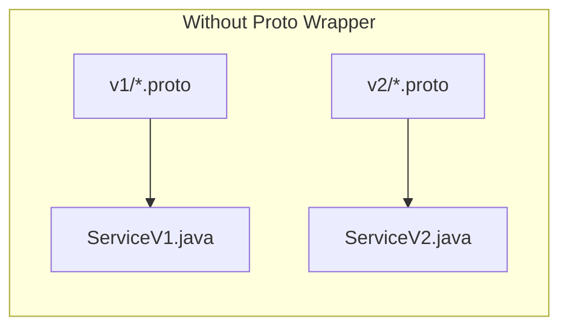
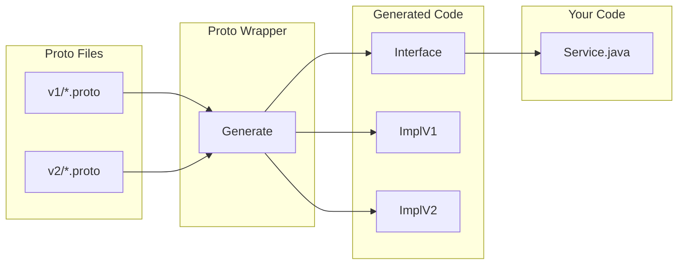

# Proto Wrapper Plugin

[](https://github.com/alnovis/proto-wrapper-plugin/actions/workflows/build.yml)
[](https://github.com/alnovis/proto-wrapper-plugin/actions/workflows/code_quality.yml)
[](https://central.sonatype.com/artifact/io.alnovis/proto-wrapper-core)
[](LICENSE)

> Generate version-agnostic Java wrappers from multiple protobuf schema versions.

Supports both **Maven** and **Gradle** build systems.

---

## The Problem

When protobuf schemas evolve across versions, you face:

- **Type mismatches**: `int32` in v1 becomes `enum` in v2
- **Version-specific code**: Different code paths for each version
- **Maintenance burden**: Changes ripple through the codebase



**Result:** Duplicate code, version-specific logic, maintenance nightmare.

## The Solution

Proto Wrapper generates a unified API that abstracts version differences:



**Usage:**

```java
// Works with v1, v2, or any future version
Order order = ctx.wrapOrder(anyVersionProto);

// Type conflicts handled automatically
PaymentType type = order.getPaymentType();  // Auto-converted from int or enum
long amount = order.getTotalAmount();        // Auto-widened from int32 or int64

// Serialize back to original version
byte[] bytes = order.toBytes();
```

---

## Quick Start

### Maven

**1. Add the plugin:**

```xml
<plugin>
    <groupId>io.alnovis</groupId>
    <artifactId>proto-wrapper-maven-plugin</artifactId>
    <version>2.1.0</version>
    <configuration>
        <basePackage>com.example.model</basePackage>
        <protoRoot>${basedir}/proto</protoRoot>
        <versions>
            <version><protoDir>v1</protoDir></version>
            <version><protoDir>v2</protoDir></version>
        </versions>
    </configuration>
    <executions>
        <execution><goals><goal>generate</goal></goals></execution>
    </executions>
</plugin>
```

**2. Generate:**

```bash
mvn generate-sources
```

### Gradle

**1. Apply the plugin:**

```kotlin
plugins {
    id("io.alnovis.proto-wrapper") version "2.1.0"
}

protoWrapper {
    basePackage.set("com.example.model")
    protoRoot.set(file("proto"))
    versions {
        version("v1")
        version("v2")
    }
}
```

**2. Generate:**

```bash
./gradlew generateProtoWrapper
```

---

## Features

| Feature | Description | Since |
|---------|-------------|-------|
| Multi-version support | Merge unlimited proto versions into unified API | v1.0 |
| Type conflict handling | Automatic conversion for int/enum, int/long, string/bytes | v1.0 |
| Builder pattern | Create and modify messages with fluent API | v1.1 |
| Well-known types | Convert Timestamp, Duration, wrappers to Java types | v1.3 |
| Oneof support | Full oneof field handling with conflict detection | v1.2 |
| Schema diff tool | Compare schemas, detect breaking changes | v1.5 |
| Incremental build | Skip unchanged protos, 50%+ faster rebuilds | v1.6 |
| Embedded protoc | Auto-download protoc, no manual installation needed | v1.6.5 |
| ProtoWrapper interface | Common base interface for type-safe proto access | v1.6.6 |
| Spring Boot Starter | Auto-configuration for Spring Boot applications | v1.6.7 |
| Java 8 compatibility | Generate Java 8 compatible code with `targetJavaVersion=8` | v2.1.0 |
| ProtocolVersions class | Centralized version constants with `generateProtocolVersions=true` | v2.1.0 |

### Type Conflict Handling

| Conflict | Example | Resolution |
|----------|---------|------------|
| INT_ENUM | `int32` ↔ `enum` | Dual getters: `getType()` + `getTypeEnum()` |
| WIDENING | `int32` → `int64` | Unified as wider type with range validation |
| STRING_BYTES | `string` ↔ `bytes` | Dual getters: `getText()` + `getTextBytes()` |
| PRIMITIVE_MESSAGE | `int32` → `Money` | Dual getters with runtime support checks |

---

## Documentation

| Document | Description |
|----------|-------------|
| **[Getting Started](docs/GETTING_STARTED.md)** | Step-by-step tutorial (15 min) |
| [Configuration](docs/CONFIGURATION.md) | All plugin options for Maven and Gradle |
| [Spring Boot Starter](docs/SPRING_BOOT_STARTER.md) | Integration with Spring Boot |
| [Cookbook](docs/COOKBOOK.md) | Practical examples and patterns |
| [Contract Matrix](docs/CONTRACT-MATRIX.md) | Field behavior reference (getter/has for all types) |
| [Schema Diff](docs/SCHEMA_DIFF.md) | Compare schemas and detect breaking changes |
| [Incremental Build](docs/INCREMENTAL_BUILD.md) | Build optimization details |
| [Known Issues](docs/KNOWN_ISSUES.md) | Limitations and workarounds |
| [Architecture](docs/ARCHITECTURE.md) | Internal design (for contributors) |
| [API Reference](docs/API_REFERENCE.md) | Generated code reference |

## Examples

- [Maven Example](examples/maven-example) - Complete Maven project with tests
- [Gradle Example](examples/gradle-example) - Complete Gradle project
- [Spring Boot Example](examples/spring-boot-example) - Spring Boot integration

---

## Generated Code Structure

```
target/generated-sources/proto-wrapper/
└── com/example/model/
    ├── api/
    │   ├── Order.java              # Interface
    │   ├── PaymentType.java        # Unified enum
    │   ├── VersionContext.java     # Version factory interface
    │   ├── ProtocolVersions.java   # Version constants (optional)
    │   └── impl/
    │       └── AbstractOrder.java  # Template methods
    ├── v1/
    │   ├── OrderV1.java            # V1 implementation
    │   └── VersionContextV1.java
    └── v2/
        ├── OrderV2.java            # V2 implementation
        └── VersionContextV2.java
```

---

## Requirements

- Java 17+
- Maven 3.8+ or Gradle 8.5+

**No manual protoc installation required!** The plugin automatically downloads the appropriate `protoc` binary from Maven Central if not found in PATH.

---

## Installation

### From Maven Central

Add dependency (plugins auto-download):

```xml
<dependency>
    <groupId>io.alnovis</groupId>
    <artifactId>proto-wrapper-core</artifactId>
    <version>2.1.0</version>
</dependency>
```

### From Source

```bash
git clone https://github.com/alnovis/proto-wrapper-plugin.git
cd proto-wrapper-plugin
mvn clean install                    # Maven modules
./gradlew publishToMavenLocal        # Gradle plugin
```

---

## Contributing

Contributions are welcome! See [CONTRIBUTING.md](CONTRIBUTING.md) for guidelines.

## License

Apache License 2.0 - see [LICENSE](LICENSE) for details.

---

## See Also

- [Changelog](CHANGELOG.md) - Version history
- [Roadmap](docs/ROADMAP.md) - Planned features and releases
- [Release Notes](RELEASE_NOTES.md) - Detailed release information


