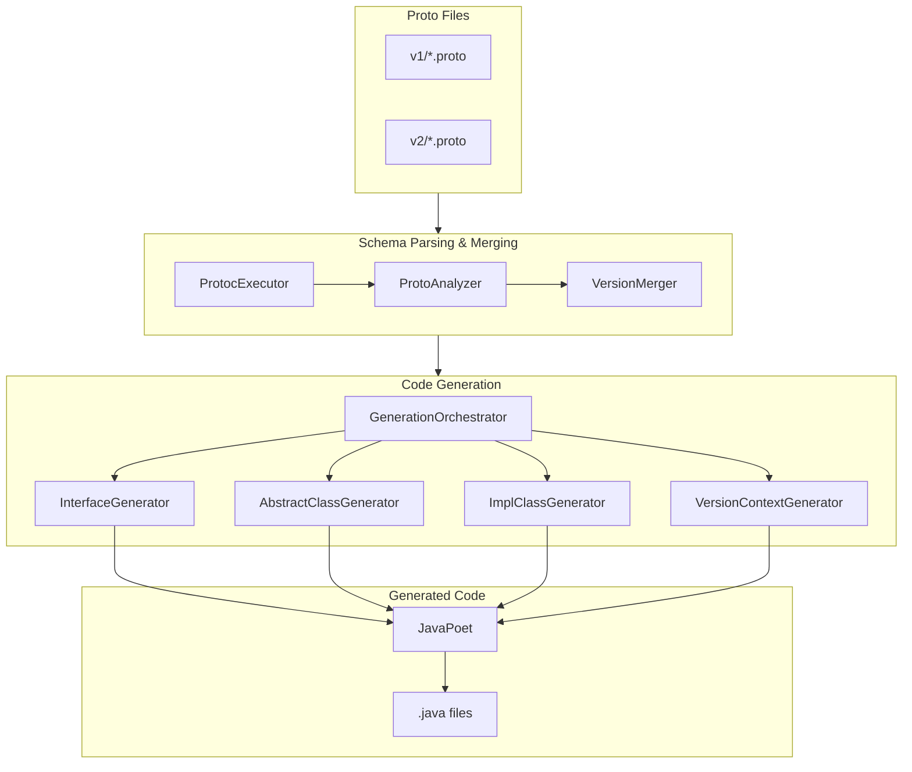
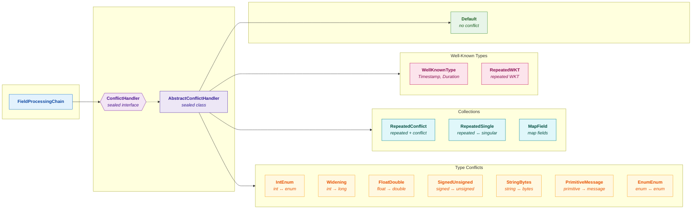

# Proto Wrapper Plugin

[](https://github.com/alnovis/proto-wrapper-plugin/actions/workflows/build.yml)
[](https://maven-badges.sml.io/sonatype-central/space.alnovis/proto-wrapper-core/)

Build plugins for generating version-agnostic Java wrapper classes from multiple protobuf schema versions.

Supports both **Maven** and **Gradle** build systems.

## Features

- Automatic parsing of `.proto` files via `protoc`
- Merging multiple schema versions into a unified API
- Generation of:
  - Version-agnostic interfaces
  - Abstract base classes (Template Method pattern)
  - Version-specific implementations
  - VersionContext for factory operations
  - Builder pattern for modifications (optional)
- Automatic type conflict handling:
  - `INT_ENUM`: int ↔ enum conversion
  - `WIDENING`: int → long, float → double
  - `STRING_BYTES`: string ↔ bytes (UTF-8)
  - `PRIMITIVE_MESSAGE`: primitive ↔ message
- **Google Well-Known Types support** (v1.3.0+):
  - `Timestamp` → `java.time.Instant`
  - `Duration` → `java.time.Duration`
  - Wrapper types → nullable Java primitives
  - `Struct/Value/ListValue` → `Map/Object/List`
- **Repeated conflict field builders** (v1.4.0+):
  - Full builder support for repeated fields with type conflicts
  - Runtime range validation for narrowing conversions
- **Schema Diff Tool** (v1.5.0+):
  - Compare proto schemas across versions
  - Detect breaking changes automatically
  - Multiple output formats (text, JSON, Markdown)
  - CLI, Maven goal, and Gradle task support
- **Incremental Generation** (v1.6.0+):
  - Only regenerate when proto files change
  - >50% build time reduction for unchanged schemas
  - Dependency-aware regeneration (respects imports)
  - Automatic cache invalidation on config/version changes
- Automatic detection of equivalent enums (nested vs top-level)
- Supported versions info in Javadoc
- Thread-safe immutable wrappers
- Oneof field support with conflict detection

## Documentation

| Document | Description |
|----------|-------------|
| [COOKBOOK.md](docs/COOKBOOK.md) | Practical guide with examples |
| [API_REFERENCE.md](docs/API_REFERENCE.md) | Generated code API reference |
| [VERSION_AGNOSTIC_API.md](docs/VERSION_AGNOSTIC_API.md) | Detailed API documentation |
| [KNOWN_ISSUES.md](docs/KNOWN_ISSUES.md) | Known limitations and workarounds |

## Installation

### Maven

```bash
cd proto-wrapper-plugin
mvn install
```

### Gradle

```bash
cd proto-wrapper-plugin
./gradlew publishToMavenLocal
```

## Quick Start

### Maven

#### 1. Add the plugin to pom.xml

```xml
<plugin>
    <groupId>space.alnovis</groupId>
    <artifactId>proto-wrapper-maven-plugin</artifactId>
    <version>1.6.0</version>
    <configuration>
        <basePackage>com.mycompany.myapp.model</basePackage>
        <protoRoot>${basedir}/src/main/proto</protoRoot>
        <versions>
            <version><protoDir>v1</protoDir></version>
            <version><protoDir>v2</protoDir></version>
        </versions>
    </configuration>
    <executions>
        <execution>
            <goals><goal>generate</goal></goals>
        </execution>
    </executions>
</plugin>
```

#### 2. Organize proto files

```
src/main/proto/
├── v1/
│   ├── common.proto
│   └── order.proto
└── v2/
    ├── common.proto
    └── order.proto
```

#### 3. Generate code

```bash
mvn generate-sources
```

### Gradle

#### 1. Add the plugin to build.gradle.kts

```kotlin
plugins {
    id("space.alnovis.proto-wrapper") version "1.6.0"
}

protoWrapper {
    basePackage.set("com.mycompany.myapp.model")
    protoRoot.set(file("src/main/proto"))
    versions {
        version("v1")
        version("v2")
    }
}
```

#### 2. Organize proto files

```
src/main/proto/
├── v1/
│   ├── common.proto
│   └── order.proto
└── v2/
    ├── common.proto
    └── order.proto
```

#### 3. Generate code

```bash
./gradlew generateProtoWrapper
```

### 4. Use the API

```java
// Determine version and wrap proto
int version = determineVersion(protoBytes);
VersionContext ctx = VersionContext.forVersion(version);

Order order = ctx.wrapOrder(OrderProto.parseFrom(protoBytes));

// Use version-agnostic API
DateTime dateTime = order.getDateTime();
List<OrderItem> items = order.getItems();
PaymentType payment = order.getPaymentType();

// Serialize back
byte[] outputBytes = order.toBytes();
```

## Generated Code Structure

With `basePackage=com.mycompany.myapp.model`:

**Maven:** `target/generated-sources/proto-wrapper/`
**Gradle:** `build/generated/sources/proto-wrapper/main/java/`

```
{output-dir}/
├── com/mycompany/myapp/model/api/
│   ├── Money.java                    # Interface
│   ├── Order.java                    # Interface with nested interfaces
│   ├── PaymentTypeEnum.java          # Unified enum
│   ├── VersionContext.java           # Factory interface
│   └── impl/
│       ├── AbstractMoney.java        # Abstract base class
│       └── AbstractOrder.java
├── com/mycompany/myapp/model/v1/
│   ├── MoneyV1.java                  # Implementation
│   ├── OrderV1.java
│   └── VersionContextV1.java
└── com/mycompany/myapp/model/v2/
    ├── MoneyV2.java
    ├── OrderV2.java
    └── VersionContextV2.java
```

## Configuration

### Parameters

| Parameter | Default | Description |
|-----------|---------|-------------|
| `basePackage` | (required) | Base package for all generated classes |
| `protoRoot` | (required) | Root directory with proto files |
| `versions` | (required) | List of version configurations |
| `outputDirectory` | `target/generated-sources/proto-wrapper` (Maven) or `build/generated/sources/proto-wrapper/main/java` (Gradle) | Output directory |
| `protoPackagePattern` | `{basePackage}.proto.{version}` | Package pattern for proto classes |
| `generateBuilders` | `false` | Generate Builder pattern for modifications |
| `protobufMajorVersion` | `3` | Protobuf version (2 or 3) |
| `includeVersionSuffix` | `true` | Include version suffix (MoneyV1 vs Money) |
| `convertWellKnownTypes` | `true` | Convert Google Well-Known Types to Java types |
| `generateRawProtoAccessors` | `false` | Generate `getXxxProto()` methods for WKT fields |
| `includeMessages` | (all) | List of message names to include |
| `excludeMessages` | (none) | List of message names to exclude |

### Version Parameters

| Parameter | Description |
|-----------|-------------|
| `protoDir` | Directory with proto files relative to `protoRoot` |
| `name` | Version name (defaults to uppercase: `v1` → `V1`) |
| `excludeProtos` | List of proto files to exclude |

### Extended Configuration (Maven)

```xml
<configuration>
    <basePackage>com.mycompany.myapp.model</basePackage>
    <protoRoot>${basedir}/proto</protoRoot>
    <protoPackagePattern>com.mycompany.myapp.proto.{version}</protoPackagePattern>
    <outputDirectory>${project.build.directory}/generated-sources/proto-wrapper</outputDirectory>
    <generateBuilders>true</generateBuilders>
    <protobufMajorVersion>3</protobufMajorVersion>

    <versions>
        <version>
            <protoDir>v1</protoDir>
            <name>V1</name>
            <excludeProtos>
                <excludeProto>internal.proto</excludeProto>
            </excludeProtos>
        </version>
        <version>
            <protoDir>v2</protoDir>
        </version>
    </versions>

    <includeMessages>
        <message>Order</message>
        <message>Customer</message>
    </includeMessages>
</configuration>
```

### Extended Configuration (Gradle)

```kotlin
protoWrapper {
    basePackage.set("com.mycompany.myapp.model")
    protoRoot.set(file("proto"))
    protoPackagePattern.set("com.mycompany.myapp.proto.{version}")
    outputDirectory.set(layout.buildDirectory.dir("generated/sources/proto-wrapper/main/java"))
    generateBuilders.set(true)
    protobufMajorVersion.set(3)

    versions {
        version("v1") {
            name.set("V1")
            excludeProtos.set(listOf("internal.proto"))
        }
        version("v2")
    }

    includeMessages.set(listOf("Order", "Customer"))
}
```

## Type Conflict Handling

The plugin automatically handles situations when field types differ between versions:

| Conflict Type | Example | Read API | Builder API |
|---------------|---------|----------|-------------|
| `NONE` | Same type | Normal getter | Normal setter |
| `INT_ENUM` | int ↔ enum | `getXxx()` + `getXxxEnum()` | `setXxx(int)` + `setXxx(Enum)` |
| `WIDENING` | int → long | Auto-widened | Setter with range check |
| `NARROWING` | long → int | Uses wider type | Setter with range check |
| `STRING_BYTES` | string ↔ bytes | `getXxx()` + `getXxxBytes()` | `setXxx(String)` |
| `PRIMITIVE_MESSAGE` | int → Message | `getXxx()` + `getXxxMessage()` | Not generated |
| `INCOMPATIBLE` | string ↔ int | Returns default | Not generated |

See [COOKBOOK.md](docs/COOKBOOK.md) for detailed examples of each conflict type.

## Builder Support

Enable builder generation for creating and modifying messages:

**Maven:**
```xml
<configuration>
    <generateBuilders>true</generateBuilders>
</configuration>
```

**Gradle:**
```kotlin
protoWrapper {
    generateBuilders.set(true)
}
```

### Usage

```java
// Modify existing wrapper
Order modified = order.toBuilder()
    .setCustomerId("CUST-123")
    .setTotalAmount(10000L)
    .build();

// Create new wrapper (using VersionContext)
Order newOrder = ctx.newOrderBuilder()
    .setOrderId("ORD-456")
    .setCustomerId("CUST-789")
    .build();

// Create new wrapper (using static newBuilder - recommended)
Order anotherOrder = Order.newBuilder(ctx)
    .setOrderId("ORD-789")
    .setCustomerId("CUST-123")
    .build();

// Works with nested types too
Address.GeoLocation location = Address.GeoLocation.newBuilder(ctx)
    .setLatitude(40.7128)
    .setLongitude(-74.0060)
    .build();
```

### Protobuf Version Compatibility

| protobufMajorVersion | Enum Conversion Method |
|---------------------|----------------------|
| `2` | `EnumType.valueOf(int)` |
| `3` (default) | `EnumType.forNumber(int)` |

## Well-Known Types Support

Since v1.3.0, Google Well-Known Types are automatically converted to idiomatic Java types.

### Supported Types

| Proto Type | Java Type |
|------------|-----------|
| `google.protobuf.Timestamp` | `java.time.Instant` |
| `google.protobuf.Duration` | `java.time.Duration` |
| `google.protobuf.StringValue` | `String` (nullable) |
| `google.protobuf.Int32Value` | `Integer` (nullable) |
| `google.protobuf.Int64Value` | `Long` (nullable) |
| `google.protobuf.UInt32Value` | `Long` (nullable) |
| `google.protobuf.UInt64Value` | `Long` (nullable) |
| `google.protobuf.BoolValue` | `Boolean` (nullable) |
| `google.protobuf.FloatValue` | `Float` (nullable) |
| `google.protobuf.DoubleValue` | `Double` (nullable) |
| `google.protobuf.BytesValue` | `byte[]` (nullable) |
| `google.protobuf.FieldMask` | `List<String>` |
| `google.protobuf.Struct` | `Map<String, Object>` |
| `google.protobuf.Value` | `Object` |
| `google.protobuf.ListValue` | `List<Object>` |

### Usage Example

```java
// Proto definition:
// google.protobuf.Timestamp created_at = 1;
// google.protobuf.Duration timeout = 2;
// google.protobuf.StringValue optional_name = 3;

// Generated interface:
public interface Event {
    Instant getCreatedAt();        // java.time.Instant
    Duration getTimeout();          // java.time.Duration
    String getOptionalName();       // nullable String
}

// Usage:
Event event = ctx.wrapEvent(protoEvent);
Instant createdAt = event.getCreatedAt();
Duration timeout = event.getTimeout();
String name = event.getOptionalName();  // null if not set
```

### Configuration

```xml
<!-- Disable WKT conversion (keep proto types) -->
<configuration>
    <convertWellKnownTypes>false</convertWellKnownTypes>
</configuration>
```

**Note:** `google.protobuf.Any` is not supported because it requires a runtime type registry.

## Schema Diff Tool

Since v1.5.0, Proto Wrapper includes a schema comparison tool that detects changes between protobuf schema versions, including breaking changes that could affect wire compatibility.

### Features

- Compare two proto schema directories
- Detect added, modified, and removed messages/enums/fields
- Identify breaking changes (field removal, type incompatibility, etc.)
- Multiple output formats: text, JSON, Markdown
- CI/CD integration with exit codes
- Available as CLI, Maven goal, and Gradle task

### CLI Usage

The CLI is packaged as an executable JAR (`proto-wrapper-core-1.6.0-cli.jar`).

```bash
# Basic comparison
java -jar proto-wrapper-core-1.6.0-cli.jar diff proto/v1 proto/v2

# Output formats
java -jar proto-wrapper-core-1.6.0-cli.jar diff proto/v1 proto/v2 --format=text
java -jar proto-wrapper-core-1.6.0-cli.jar diff proto/v1 proto/v2 --format=json
java -jar proto-wrapper-core-1.6.0-cli.jar diff proto/v1 proto/v2 --format=markdown

# Show only breaking changes
java -jar proto-wrapper-core-1.6.0-cli.jar diff proto/v1 proto/v2 --breaking-only

# Write to file
java -jar proto-wrapper-core-1.6.0-cli.jar diff proto/v1 proto/v2 --output=diff-report.md

# CI/CD mode: exit code 1 if breaking changes detected
java -jar proto-wrapper-core-1.6.0-cli.jar diff proto/v1 proto/v2 --fail-on-breaking

# Custom version names
java -jar proto-wrapper-core-1.6.0-cli.jar diff proto/v1 proto/v2 --v1-name=production --v2-name=development

# Quiet mode (suppress info messages)
java -jar proto-wrapper-core-1.6.0-cli.jar diff proto/v1 proto/v2 -q

# Custom protoc path
java -jar proto-wrapper-core-1.6.0-cli.jar diff proto/v1 proto/v2 --protoc=/usr/local/bin/protoc
```

#### CLI Options

| Option | Description |
|--------|-------------|
| `--v1-name=<name>` | Name for source version (default: v1) |
| `--v2-name=<name>` | Name for target version (default: v2) |
| `-f, --format=<fmt>` | Output format: text, json, markdown (default: text) |
| `-o, --output=<file>` | Write output to file instead of console |
| `-b, --breaking-only` | Show only breaking changes |
| `--fail-on-breaking` | Exit with code 1 if breaking changes detected |
| `--fail-on-warning` | Treat warnings as errors |
| `--protoc=<path>` | Path to protoc executable |
| `-q, --quiet` | Suppress informational messages |
| `-h, --help` | Show help message |
| `-V, --version` | Print version information |

### Maven Usage

Use the `diff` goal to compare schemas:

```bash
# Basic usage
mvn proto-wrapper:diff -Dv1=proto/v1 -Dv2=proto/v2

# With output format
mvn proto-wrapper:diff -Dv1=proto/v1 -Dv2=proto/v2 -Dformat=markdown

# Write to file
mvn proto-wrapper:diff -Dv1=proto/v1 -Dv2=proto/v2 -Doutput=target/diff-report.md

# Fail on breaking changes (CI/CD)
mvn proto-wrapper:diff -Dv1=proto/v1 -Dv2=proto/v2 -DfailOnBreaking=true

# Show only breaking changes
mvn proto-wrapper:diff -Dv1=proto/v1 -Dv2=proto/v2 -DbreakingOnly=true

# Custom version names
mvn proto-wrapper:diff -Dv1=proto/v1 -Dv2=proto/v2 -Dv1Name=production -Dv2Name=development
```

#### Maven Configuration in pom.xml

```xml
<plugin>
    <groupId>space.alnovis</groupId>
    <artifactId>proto-wrapper-maven-plugin</artifactId>
    <version>1.6.0</version>
    <executions>
        <!-- Schema diff during verify phase -->
        <execution>
            <id>check-breaking-changes</id>
            <phase>verify</phase>
            <goals>
                <goal>diff</goal>
            </goals>
            <configuration>
                <v1>${basedir}/proto/production</v1>
                <v2>${basedir}/proto/development</v2>
                <v1Name>production</v1Name>
                <v2Name>development</v2Name>
                <outputFormat>markdown</outputFormat>
                <outputFile>${project.build.directory}/schema-diff.md</outputFile>
                <failOnBreaking>true</failOnBreaking>
            </configuration>
        </execution>
    </executions>
</plugin>
```

#### Maven Goal Parameters

| Parameter | Default | Description |
|-----------|---------|-------------|
| `v1` | (required) | Directory with source (older) version proto files |
| `v2` | (required) | Directory with target (newer) version proto files |
| `v1Name` | `v1` | Name for source version in reports |
| `v2Name` | `v2` | Name for target version in reports |
| `format` | `text` | Output format: text, json, markdown |
| `output` | (console) | Output file path |
| `breakingOnly` | `false` | Show only breaking changes |
| `failOnBreaking` | `false` | Fail build on breaking changes |
| `failOnWarning` | `false` | Treat warnings as errors |
| `protoc.path` | (from PATH) | Custom protoc executable path |

### Gradle Usage

Register and configure a `SchemaDiffTask`:

```kotlin
// build.gradle.kts
plugins {
    id("space.alnovis.proto-wrapper") version "1.6.0"
}

// Register diff task
tasks.register<space.alnovis.protowrapper.gradle.SchemaDiffTask>("diffSchemas") {
    v1Directory.set(file("proto/v1"))
    v2Directory.set(file("proto/v2"))
    v1Name.set("v1")
    v2Name.set("v2")
    outputFormat.set("markdown")
    outputFile.set(file("build/reports/schema-diff.md"))
    failOnBreaking.set(false)
    breakingOnly.set(false)
}

// Run as part of check
tasks.named("check") {
    dependsOn("diffSchemas")
}
```

```bash
# Run diff task
./gradlew diffSchemas

# Run with CI mode (fail on breaking)
./gradlew diffSchemas -PfailOnBreaking=true
```

#### Gradle Task Properties

| Property | Type | Default | Description |
|----------|------|---------|-------------|
| `v1Directory` | `DirectoryProperty` | (required) | Source version directory |
| `v2Directory` | `DirectoryProperty` | (required) | Target version directory |
| `v1Name` | `Property<String>` | `v1` | Name for source version |
| `v2Name` | `Property<String>` | `v2` | Name for target version |
| `outputFormat` | `Property<String>` | `text` | Output format: text, json, markdown |
| `outputFile` | `RegularFileProperty` | (console) | Output file |
| `breakingOnly` | `Property<Boolean>` | `false` | Show only breaking changes |
| `failOnBreaking` | `Property<Boolean>` | `false` | Fail task on breaking changes |

### Output Examples

#### Text Format

```
Schema Comparison: v1 -> v2

================================================================================
MESSAGES
================================================================================

+ ADDED: Profile (user.proto)
    Fields:
      - user_id: int64 (#1)
      - bio: string (#2)

~ MODIFIED: User
    + Added field: phone (string, #7)
    - Removed field: email (#3) [BREAKING]

- REMOVED: DeprecatedMessage [BREAKING]

================================================================================
BREAKING CHANGES
================================================================================

ERRORS (2):
  [ERROR] FIELD_REMOVED: User.email (was: string email = 3)
  [ERROR] MESSAGE_REMOVED: DeprecatedMessage (was: DeprecatedMessage)

================================================================================
SUMMARY
================================================================================

Messages:  +1 added, ~1 modified, -1 removed
Enums:     +0 added, ~0 modified, -0 removed
Breaking:  2 errors, 0 warnings
```

#### JSON Format

```json
{
  "v1": "v1",
  "v2": "v2",
  "summary": {
    "addedMessages": 1,
    "removedMessages": 1,
    "modifiedMessages": 1,
    "errorCount": 2,
    "warningCount": 0
  },
  "messages": {
    "added": [{"name": "Profile", "sourceFile": "user.proto"}],
    "removed": [{"name": "DeprecatedMessage"}],
    "modified": [{"name": "User", "fieldChanges": [...]}]
  },
  "breakingChanges": [
    {"type": "FIELD_REMOVED", "severity": "ERROR", "entityPath": "User.email"},
    {"type": "MESSAGE_REMOVED", "severity": "ERROR", "entityPath": "DeprecatedMessage"}
  ]
}
```

#### Markdown Format

```markdown
# Schema Comparison: v1 -> v2

## Summary

| Category | Added | Modified | Removed |
|----------|-------|----------|---------|
| Messages | 1 | 1 | 1 |

**Breaking Changes:** 2 errors, 0 warnings

## Breaking Changes

| Severity | Type | Entity | Description |
|----------|------|--------|-------------|
| ERROR | FIELD_REMOVED | User.email | Field removed |
| ERROR | MESSAGE_REMOVED | DeprecatedMessage | Message removed |
```

### Breaking Change Types

| Type | Severity | Description |
|------|----------|-------------|
| `MESSAGE_REMOVED` | ERROR | Message was removed |
| `FIELD_REMOVED` | ERROR | Field was removed from message |
| `FIELD_NUMBER_CHANGED` | ERROR | Field number was changed |
| `FIELD_TYPE_INCOMPATIBLE` | ERROR | Field type changed incompatibly |
| `ENUM_REMOVED` | ERROR | Enum was removed |
| `ENUM_VALUE_REMOVED` | ERROR | Enum value was removed |
| `ENUM_VALUE_NUMBER_CHANGED` | ERROR | Enum value number changed |
| `REQUIRED_FIELD_ADDED` | WARNING | Required field added (proto2) |
| `LABEL_CHANGED_TO_REQUIRED` | WARNING | Field changed to required |
| `CARDINALITY_CHANGED` | WARNING | Field cardinality changed |
| `ONEOF_FIELD_MOVED` | WARNING | Field moved in/out of oneof |

### Programmatic API

```java
import space.alnovis.protowrapper.diff.SchemaDiff;
import space.alnovis.protowrapper.diff.model.*;

// Compare schemas
SchemaDiff diff = SchemaDiff.compare(
    Path.of("proto/v1"),
    Path.of("proto/v2"),
    "production",
    "development"
);

// Query differences
List<MessageInfo> added = diff.getAddedMessages();
List<MessageInfo> removed = diff.getRemovedMessages();
List<MessageDiff> modified = diff.getModifiedMessages();

// Check breaking changes
if (diff.hasBreakingChanges()) {
    for (BreakingChange bc : diff.getBreakingChanges()) {
        System.err.println(bc.severity() + ": " + bc.entityPath() + " - " + bc.description());
    }
}

// Export to different formats
String textReport = diff.toText();
String jsonReport = diff.toJson();
String markdownReport = diff.toMarkdown();

// Get summary
SchemaDiff.DiffSummary summary = diff.getSummary();
System.out.println("Added: " + summary.addedMessages() + " messages");
System.out.println("Breaking: " + summary.errorCount() + " errors");
```

## Incremental Generation

Since v1.6.0, Proto Wrapper supports incremental generation to significantly reduce build times. When no proto files have changed, the plugin skips code generation entirely. When files change, only affected wrappers are regenerated.

### Features

- **Smart change detection** - Uses SHA-256 content hashing and timestamps
- **Dependency tracking** - Tracks proto imports to regenerate dependents
- **Auto-invalidation** - Full regeneration on plugin version or config changes
- **Graceful recovery** - Handles corrupted cache by performing full regeneration
- **Thread-safe** - File locking for safe concurrent builds in CI/CD environments

### Configuration

Incremental generation is **enabled by default**. No configuration needed for typical use cases.

#### Maven

```xml
<configuration>
    <basePackage>com.example.model</basePackage>
    <!-- Incremental generation (default: true) -->
    <incremental>true</incremental>
    <!-- Cache directory (default: ${project.build.directory}/proto-wrapper-cache) -->
    <cacheDirectory>${project.build.directory}/proto-wrapper-cache</cacheDirectory>
    <!-- Force full regeneration (default: false) -->
    <forceRegenerate>false</forceRegenerate>
</configuration>
```

```bash
# Normal build (incremental)
mvn compile

# Force full regeneration
mvn compile -Dproto-wrapper.force=true

# Disable incremental mode
mvn compile -Dproto-wrapper.incremental=false
```

#### Gradle

```kotlin
protoWrapper {
    basePackage.set("com.example.model")
    // Incremental generation (default: true)
    incremental.set(true)
    // Cache directory (default: build/proto-wrapper-cache)
    cacheDirectory.set(layout.buildDirectory.dir("proto-wrapper-cache"))
    // Force full regeneration (default: false)
    forceRegenerate.set(false)
}
```

```bash
# Normal build (incremental)
./gradlew generateProtoWrapper

# Force full regeneration
./gradlew generateProtoWrapper -Pproto-wrapper.force=true

# Clean regeneration
./gradlew clean generateProtoWrapper
```

### Parameters

| Parameter | Default | Description |
|-----------|---------|-------------|
| `incremental` | `true` | Enable incremental generation |
| `cacheDirectory` | `${build}/proto-wrapper-cache` | Directory for incremental state cache |
| `forceRegenerate` | `false` | Force full regeneration, ignoring cache |

### Cache Invalidation

The plugin automatically performs full regeneration when:

| Condition | Reason |
|-----------|--------|
| Plugin version changed | Generated code format may differ |
| Configuration changed | Output structure may differ |
| Proto file deleted | May break dependencies |
| Cache file corrupted | Recovery mode |
| `forceRegenerate=true` | User requested |
| `clean` task executed | Cache deleted |

Partial regeneration occurs when:
- Proto file content changed (regenerate that file + dependents)
- New proto file added (regenerate new file + dependents)
- Import dependencies changed (regenerate affected files)

### How It Works

1. **First build**: Full generation, cache created
2. **Subsequent builds**:
   - Load previous state from `state.json`
   - Compute fingerprints for all proto files
   - Compare with cached fingerprints
   - Regenerate only changed files and their dependents
3. **Cache structure**:
   ```
   proto-wrapper-cache/
   └── state.json      # Fingerprints, dependencies, timestamps
   ```

### Performance

Typical build time improvements:
- No changes: **>80% reduction** (only fingerprint comparison)
- Single file change: **50-70% reduction** (regenerate subset)
- Config/version change: **0% reduction** (full regeneration required)

## Generated Code Examples

### Interface

```java
public interface Money {
    long getBills();
    int getCoins();

    int getWrapperVersion();
    byte[] toBytes();
    Message getProto();

    // With generateBuilders=true
    Builder toBuilder();

    // Static factory method (v1.1.1+)
    static Builder newBuilder(VersionContext ctx) {
        return ctx.newMoneyBuilder();
    }

    interface Builder {
        Builder setBills(long value);
        Builder setCoins(int value);
        Money build();
    }
}
```

### Abstract Class (Template Method Pattern)

```java
public abstract class AbstractMoney<P extends Message> implements Money {
    protected final P proto;

    protected AbstractMoney(P proto) {
        this.proto = proto;
    }

    protected abstract long extractBills(P proto);
    protected abstract int extractCoins(P proto);

    @Override
    public final long getBills() {
        return extractBills(proto);
    }

    @Override
    public final int getCoins() {
        return extractCoins(proto);
    }
}
```

### VersionContext

```java
// Get context for version
VersionContext ctx = VersionContext.forVersion(2);

// Wrap proto message
Money money = ctx.wrapMoney(protoMessage);
Order order = ctx.wrapOrder(orderProto);

// Create new builder (with generateBuilders=true)
Order.Builder builder = ctx.newOrderBuilder();
```

## Architecture



### Conflict Handling Architecture



## Limitations

See [KNOWN_ISSUES.md](docs/KNOWN_ISSUES.md) for complete documentation.

**Summary:**
- `oneof` fields: supported with conflict detection (v1.2.0+)
- `map` fields: full support (v1.2.0+)
- Well-known types: 15 types supported (v1.3.0+), `google.protobuf.Any` not supported
- Repeated fields with conflicts: full builder support with range validation (v1.4.0+)
- Extensions (proto2): not supported
- Version conversion (`asVersion`): implemented via serialization

## Development

The project uses a dual-build system: Maven for core and Maven plugin, Gradle for Gradle plugin.

### Prerequisites

- Java 17 or higher
- Maven 3.8+
- Gradle 8.5+ (or use included wrapper)
- Protocol Buffers compiler (`protoc`) installed and in PATH

### Maven Build

```bash
# Build all Maven modules (core + Maven plugin)
mvn clean install

# Run unit tests
mvn test

# Run Maven integration tests
mvn verify -pl proto-wrapper-maven-integration-tests

# Build without tests
mvn install -DskipTests

# Build specific module
mvn install -pl proto-wrapper-core
```

### Gradle Build

```bash
# Build Gradle modules (core + Gradle plugin)
./gradlew build

# Run unit tests
./gradlew test

# Publish to local Maven repository (required before integration tests)
./gradlew publishToMavenLocal

# Run Gradle integration tests (requires publishToMavenLocal first)
cd proto-wrapper-gradle-integration-tests
gradle test --no-daemon

# Build without tests
./gradlew build -x test
```

### Full Build (Maven + Gradle)

```bash
# Option 1: Maven first, then Gradle
mvn clean install
./gradlew build publishToMavenLocal
cd proto-wrapper-gradle-integration-tests && gradle test --no-daemon

# Option 2: Using Gradle tasks
./gradlew buildAll  # Builds everything including Maven modules
```

### Project Modules

| Module | Build System | Description |
|--------|--------------|-------------|
| `proto-wrapper-core` | Maven + Gradle | Core library (schema parsing, merging, code generation) |
| `proto-wrapper-maven-plugin` | Maven | Maven plugin for code generation |
| `proto-wrapper-gradle-plugin` | Gradle | Gradle plugin for code generation |
| `proto-wrapper-maven-integration-tests` | Maven | Integration tests for Maven plugin |
| `proto-wrapper-gradle-integration-tests` | Gradle (standalone) | Integration tests for Gradle plugin |
| `examples/maven-example` | Maven | Example Maven project |
| `examples/gradle-example` | Gradle | Example Gradle project |

### Test Structure

```
test-protos/scenarios/           # Shared test proto files
├── generation/                  # Proto files for generation tests
│   ├── v1/
│   └── v2/
└── diff/                        # Proto files for Schema Diff tests
    ├── 01-simple-add/
    ├── 02-simple-remove/
    └── ...

proto-wrapper-core/src/test/                    # Core unit tests
proto-wrapper-maven-integration-tests/src/test/ # Maven integration tests
proto-wrapper-gradle-integration-tests/src/test/# Gradle integration tests
```

## See Also

- [COOKBOOK.md](docs/COOKBOOK.md) - Practical usage guide
- [API_REFERENCE.md](docs/API_REFERENCE.md) - Generated code API reference
- [VERSION_AGNOSTIC_API.md](docs/VERSION_AGNOSTIC_API.md) - Detailed API documentation
- [KNOWN_ISSUES.md](docs/KNOWN_ISSUES.md) - Known limitations and workarounds
- [examples/maven-example](examples/maven-example) - Maven example project
- [examples/gradle-example](examples/gradle-example) - Gradle example project

