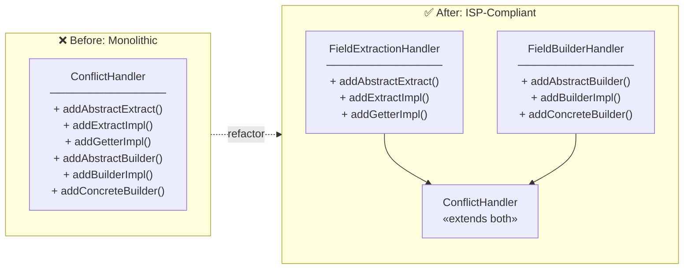

# Release Notes - Proto Wrapper Plugin v1.6.5

**Release Date:** January 14, 2026

## Overview

Version 1.6.5 introduces **embedded protoc support** - the plugin now automatically downloads the appropriate `protoc` binary from Maven Central if not found in PATH. No manual installation required!

## What's New

### Embedded Protoc Support

**No more manual protoc installation!** The plugin now handles protoc resolution automatically:

1. **Custom path** (if `protocPath` parameter is set)
2. **System PATH** (if protoc is already installed)
3. **Embedded** (auto-download from Maven Central)

#### Supported Platforms

| Platform | Architecture |
|----------|-------------|
| Linux | x86_64, aarch64 |
| macOS | x86_64, aarch64 (Apple Silicon) |
| Windows | x86_64 |

#### Caching

Downloaded protoc binaries are cached locally:
- **Linux/macOS:** `~/.cache/proto-wrapper/protoc/`
- **Windows:** `%LOCALAPPDATA%\proto-wrapper\protoc\`

#### Version Selection

By default, the plugin uses the same protobuf version as its `protobuf-java` dependency (currently 4.28.2). You can override this:

**Maven:**
```xml
<configuration>
    <protocVersion>4.28.2</protocVersion>
</configuration>
```

Or via command line:
```bash
mvn generate-sources -Dprotoc.version=4.28.2
```

**Gradle:**
```kotlin
protoWrapper {
    protocVersion.set("4.28.2")
}
```

### New Classes

- **`ProtocResolver`** - Internal component responsible for resolving protoc executable
- **`PluginVersion.getProtobufVersion()`** - Returns the protobuf version the plugin was built with

## Upgrade Guide

Simply update the version number. The change is fully backward compatible:

**Maven:**
```xml
<plugin>
    <groupId>space.alnovis</groupId>
    <artifactId>proto-wrapper-maven-plugin</artifactId>
    <version>1.6.5</version>
</plugin>
```

**Gradle:**
```kotlin
plugins {
    id("space.alnovis.proto-wrapper") version "1.6.5"
}
```

## Breaking Changes

None. Fully backward compatible with v1.6.4.

**Note:** If you had workarounds for protoc not being installed, you can now remove them. The plugin handles everything automatically.

---

# Release Notes - Proto Wrapper Plugin v1.6.4

**Release Date:** January 13, 2026

## Overview

Version 1.6.4 is a **critical bug fix release** that corrects fundamental issues with getter behavior for proto3 fields and message types. These fixes ensure consistent and predictable API behavior across all protobuf syntax versions.

## What's Fixed

### Proto3 Singular Scalar Fields (Critical)

**Problem:** Proto3 singular scalar fields (int32, bool, float, etc.) without the `optional` keyword were returning `null` even when values were set.

**Root cause:** The `needsHasCheck()` method incorrectly used the has-check pattern for proto3 singular scalars, but these fields don't have `has*()` methods in proto3.

**Impact:** Any proto3 schema without explicit `optional` keywords would experience incorrect behavior:

```protobuf
// Proto definition (proto3)
syntax = "proto3";
message Example {
    int32 value = 1;    // No 'optional' keyword
    bool flag = 2;
}
```

```java
// Before fix (incorrect)
Example msg = builder.setValue(42).setFlag(true).build();
wrapper.getValue();    // null (bug!)
wrapper.getFlag();     // null (bug!)

// After fix (correct)
wrapper.getValue();    // 42
wrapper.getFlag();     // true
```

### Message Fields Returning Default Instance

**Problem:** Unset message fields returned a wrapped default instance instead of `null`, which was inconsistent with `has*()` returning `false`.

**Root cause:** The `needsHasCheck()` method only applied to primitive fields, not message fields.

**Impact:** Confusing API behavior where `has*()` returns `false` but `get*()` returns non-null:

```java
// Before fix (inconsistent)
wrapper.hasNestedMessage();    // false
wrapper.getNestedMessage();    // NestedMessage[id=0, name=""] (default instance!)

// After fix (consistent)
wrapper.hasNestedMessage();    // false
wrapper.getNestedMessage();    // null
```

### Proto2 `required` Field Support

**Problem:** Generated wrappers returned `null` for proto2 `required` fields that were properly set in the underlying proto object.

**Root cause:** The `determineHasMethodSupport()` method only recognized `optional` fields as having `has*()` methods, ignoring that proto2 `required` fields also have `has*()` methods.

**Impact:** Any proto2 schema using `required` fields (common in legacy protocols) would experience incorrect behavior:

```protobuf
// Proto definition (proto2)
message ZXReportOfflineInfo {
    required int64 offline_count = 1;  // Has has*() method!
}
```

```java
// Before fix (incorrect)
ZXReportOfflineInfo info = ...;
info.getProto().hasOfflineCount(); // true (field is set)
wrapper.getOfflineCount();          // null (bug!)

// After fix (correct)
wrapper.getOfflineCount();          // 42 (correct value)
```

### Repeated Field Handling

**Problem:** Repeated message fields incorrectly reported having `has*()` methods.

**Fix:** The check for `LABEL_REPEATED` is now performed first, before any type-specific logic. Repeated fields never have `has*()` methods regardless of their type.

## Architecture Improvements

Version 1.6.4 also includes significant internal architecture improvements following SOLID principles.

### Interface Segregation Principle (ISP) Compliance

The `ConflictHandler` interface has been refactored to follow ISP:



**Benefits:**
- Clients can depend on the narrowest interface they need
- Read-only generators only depend on `FieldExtractionHandler`
- Builder generators only depend on `FieldBuilderHandler`
- Full handlers still use composite `ConflictHandler`

### New Utility Classes

| Class | Purpose |
|-------|---------|
| `MethodSpecFactory` | Centralized factory for MethodSpec.Builder creation |
| `VersionFieldSnapshot` | Immutable record for version field lookups |
| `ExtractMethodGenerator` | Utility for extraction method generation |
| `BuilderMethodGenerator` | Utility for builder method generation |

### New Documentation

- **[CONTRACT-MATRIX.md](docs/CONTRACT-MATRIX.md)** - Comprehensive field behavior contract matrix documenting expected behavior for all field type combinations

## Getter Behavior Summary

| Field Type | Unset Value | Set Value |
|------------|-------------|-----------|
| Proto3 singular scalar (int32, bool, etc.) | `0`, `false` (default) | actual value |
| Proto3 singular message | `null` | wrapper object |
| Proto3 optional scalar | `null` | actual value |
| Proto3 optional message | `null` | wrapper object |
| Proto2 optional scalar | `null` | actual value |
| Proto2 optional message | `null` | wrapper object |
| Proto2 required field | actual value | actual value |

## New Tests

### Golden Tests Module

Added new `proto-wrapper-golden-tests` module with **110 comprehensive tests**:

| Category | Tests |
|----------|-------|
| Proto2 required fields | 20 tests |
| Proto2 optional fields | 12 tests |
| Proto2 repeated fields | 10 tests |
| Proto3 singular fields | 20 tests |
| Proto3 optional fields | 22 tests |
| Proto3 repeated fields | 10 tests |
| Proto3 oneof fields | 14 tests |
| Cross-version consistency | 2 tests |

### FieldInfo Tests

Added 27 comprehensive tests in `FieldInfoTest` covering:

| Category | Tests |
|----------|-------|
| Proto2 optional fields | 4 tests (scalar, message, string, enum) |
| Proto2 required fields | 10 tests (all primitive types + message) |
| Proto2 repeated fields | 4 tests (scalar, message, string, enum) |
| Proto3 singular fields | 4 tests (scalar, message, oneof) |
| Proto3 repeated fields | 4 tests (scalar, message) |
| Proto3 optional scalars | 1 test |

## Upgrade Guide

Simply update the version:

**Maven:**
```xml
<plugin>
    <groupId>space.alnovis</groupId>
    <artifactId>proto-wrapper-maven-plugin</artifactId>
    <version>1.6.4</version>
</plugin>
```

**Gradle:**
```kotlin
plugins {
    id("space.alnovis.proto-wrapper") version "1.6.4"
}
```

## Breaking Changes

None. Fully backward compatible with v1.6.3.

**Note:** If your generated code was working around this bug with null checks, those workarounds can now be removed.

---

# Release Notes - Proto Wrapper Plugin v1.6.3

**Release Date:** January 6, 2026

## Overview

Version 1.6.3 is a **documentation-focused release** that significantly improves the developer experience with restructured documentation, better navigation, and new getting started guides.

## What's New

### Documentation Refactoring

The README.md has been reduced from **1118 lines to ~250 lines**, with content split into focused documents:

| Document | Description |
|----------|-------------|
| [Getting Started](docs/GETTING_STARTED.md) | Step-by-step tutorial (~15 min) |
| [Configuration](docs/CONFIGURATION.md) | All Maven/Gradle options |
| [Schema Diff](docs/SCHEMA_DIFF.md) | Schema comparison tool |
| [Incremental Build](docs/INCREMENTAL_BUILD.md) | Build optimization |
| [Cookbook](docs/COOKBOOK.md) | Practical examples |
| [Known Issues](docs/KNOWN_ISSUES.md) | Limitations & workarounds |

### Mermaid Diagrams

Added visual diagrams to README.md and ARCHITECTURE.md:
- Problem/Solution workflow diagrams
- High-level architecture pipeline
- Improved Component Diagram

### CI/CD Improvements

- Added Google Maven mirror to avoid rate limiting on GitHub Actions
- Increased retry attempts from 3 to 5
- Increased retry wait from 30s to 60s
- Added dependency prefetch step

## Upgrade Guide

Simply update the version:

**Maven:**
```xml
<plugin>
    <groupId>space.alnovis</groupId>
    <artifactId>proto-wrapper-maven-plugin</artifactId>
    <version>1.6.3</version>
</plugin>
```

**Gradle:**
```kotlin
plugins {
    id("space.alnovis.proto-wrapper") version "1.6.3"
}
```

## Breaking Changes

None. Fully backward compatible with v1.6.2.

---

# Release Notes - Proto Wrapper Plugin v1.6.2

**Release Date:** January 5, 2026

## Overview

Version 1.6.2 adds **Builder API support for PRIMITIVE_MESSAGE conflicts** - fields that change type from primitive to message across protocol versions now have full builder support with dual setters.

## What's New

### PRIMITIVE_MESSAGE Builder Support

Previously, fields with PRIMITIVE_MESSAGE conflicts (e.g., `int64` in v1 -> `Money` in v2) were read-only. Now they have full builder support:

#### Dual Setters Pattern

```java
interface Order.Builder {
    // For versions where field is primitive (v1)
    Builder setTotal(long total);

    // For versions where field is message (v2)
    Builder setTotalMessage(Money total);

    // Clear works for both
    Builder clearTotal();
}
```

#### Runtime Validation

The plugin generates runtime validation to prevent using the wrong setter:

```java
// V1 (primitive version)
Order v1 = Order.newBuilder(ctxV1)
    .setTotal(1000L)           // OK
    .build();

Order.newBuilder(ctxV1)
    .setTotalMessage(money);   // throws UnsupportedOperationException

// V2 (message version)
Order v2 = Order.newBuilder(ctxV2)
    .setTotalMessage(money)    // OK
    .build();

Order.newBuilder(ctxV2)
    .setTotal(1000L);          // throws UnsupportedOperationException
```

### New Tests

- `PrimitiveMessageBuilderTest` - 16 tests covering all builder scenarios

## Upgrade Guide

Simply update the version:

**Maven:**
```xml
<plugin>
    <groupId>space.alnovis</groupId>
    <artifactId>proto-wrapper-maven-plugin</artifactId>
    <version>1.6.2</version>
</plugin>
```

**Gradle:**
```kotlin
plugins {
    id("space.alnovis.proto-wrapper") version "1.6.2"
}
```

## Breaking Changes

None. Fully backward compatible with v1.6.1.

---

# Release Notes - Proto Wrapper Plugin v1.6.1

**Release Date:** January 5, 2026

## Overview

Version 1.6.1 is a patch release that fixes CI/CD stability issues and adds comprehensive tests for the Gradle plugin and Maven integration.

## What's New

### CI/CD Fixes

- **Exclude benchmark tests from Gradle** - The `IncrementalGenerationBenchmark` test is now excluded from regular test runs in Gradle (already excluded in Maven)
  - Benchmark tests are sensitive to VM performance and fail on GitHub Actions runners
  - Added separate `benchmarkTest` task for manual execution: `./gradlew :proto-wrapper-core:benchmarkTest`

### New Tests

#### Gradle Plugin Tests (48 total)
- `ProtoWrapperPluginTest` - 23 unit tests
- `GenerateWrappersTaskTest` - 25 functional tests with TestKit

#### Maven Integration Tests
- `IncrementalGenerationIntegrationTest` - 7 tests for incremental generation scenarios

## Upgrade Guide

Simply update the version:

**Maven:**
```xml
<plugin>
    <groupId>space.alnovis</groupId>
    <artifactId>proto-wrapper-maven-plugin</artifactId>
    <version>1.6.1</version>
</plugin>
```

**Gradle:**
```kotlin
plugins {
    id("space.alnovis.proto-wrapper") version "1.6.1"
}
```

## Breaking Changes

None. Fully backward compatible with v1.6.0.

---

# Release Notes - Proto Wrapper Plugin v1.6.0

**Release Date:** January 5, 2026

## Overview

Version 1.6.0 introduces **Incremental Generation** - a major feature that significantly reduces build times by only regenerating wrapper classes when proto files actually change. This release also adds thread-safe concurrent build support and comprehensive performance benchmarks.

## What's New

### Incremental Generation

The plugin now tracks proto file changes using SHA-256 content hashing and only regenerates affected wrapper classes. This provides:

- **>50% build time reduction** when no changes detected (benchmark shows 69.1%)
- **Dependency-aware regeneration** - tracks proto imports to regenerate dependents
- **Automatic cache invalidation** on plugin version or configuration changes

#### How It Works

```
First Build:
  Proto Files -> Fingerprint -> Generate All -> Save State

Subsequent Builds:
  Proto Files -> Compare Fingerprints -> Changed?
    No  -> Skip Generation (fast!)
    Yes -> Regenerate Affected Only -> Save State
```

#### Configuration

**Maven:**
```xml
<plugin>
    <groupId>space.alnovis</groupId>
    <artifactId>proto-wrapper-maven-plugin</artifactId>
    <version>1.6.0</version>
    <configuration>
        <basePackage>com.example.model</basePackage>

        <!-- Incremental generation (enabled by default) -->
        <incremental>true</incremental>
        <cacheDirectory>${project.build.directory}/proto-wrapper-cache</cacheDirectory>

        <!-- Force full regeneration if needed -->
        <!-- <forceRegenerate>true</forceRegenerate> -->
    </configuration>
</plugin>
```

**Gradle:**
```kotlin
protoWrapper {
    basePackage.set("com.example.model")

    // Incremental generation (enabled by default)
    incremental.set(true)
    cacheDirectory.set(layout.buildDirectory.dir("proto-wrapper-cache"))

    // Force full regeneration if needed
    // forceRegenerate.set(true)
}
```

#### Command Line Options

```bash
# Maven - Force full regeneration
mvn compile -Dproto-wrapper.force=true

# Maven - Disable incremental
mvn compile -Dproto-wrapper.incremental=false

# Gradle - Force full regeneration (use --rerun-tasks or clean)
./gradlew clean generateProtoWrappers
```

#### New Configuration Parameters

| Parameter | Default | Description |
|-----------|---------|-------------|
| `incremental` | `true` | Enable incremental generation |
| `cacheDirectory` | `${build}/proto-wrapper-cache` | Directory for incremental state cache |
| `forceRegenerate` | `false` | Force full regeneration, ignoring cache |

### Thread-Safe Concurrent Builds

The plugin now supports concurrent builds using file locking:

- **CacheLock** mechanism prevents cache corruption during parallel builds
- Safe for CI/CD environments with multiple concurrent jobs
- Automatic lock acquisition with 30-second timeout
- Graceful recovery from stale locks

### Cache Invalidation Rules

The cache is automatically invalidated when:

| Condition | Action |
|-----------|--------|
| Plugin version changed | Full regeneration |
| Configuration changed | Full regeneration |
| Proto file modified | Regenerate affected + dependents |
| Proto file added | Regenerate new + dependents |
| Proto file deleted | Full regeneration |
| Cache corrupted | Graceful recovery, full regeneration |
| `forceRegenerate=true` | Full regeneration |

### Cache State File Format

The incremental state is stored in `state.json`:

```json
{
  "pluginVersion": "1.6.0",
  "configHash": "a1b2c3d4e5f67890",
  "lastGeneration": "2026-01-05T10:30:00.000Z",
  "protoFingerprints": {
    "v1/order.proto": {
      "relativePath": "v1/order.proto",
      "contentHash": "sha256:abc123...",
      "lastModified": 1707990000000,
      "fileSize": 2048
    }
  },
  "protoDependencies": {
    "v1/order.proto": ["v1/common.proto"]
  }
}
```

### Performance Benchmarks

Benchmark results with 22 proto files:

| Scenario | Time | Improvement |
|----------|------|-------------|
| Full generation | 13.73 ms | - |
| Incremental (no changes) | 4.25 ms | **69.1%** |
| Incremental (1 file changed) | 11.53 ms | 16.0% |

Run benchmarks:
```bash
mvn test -Dtest=IncrementalGenerationBenchmark -Dgroups=benchmark
```

## New Classes

### Incremental Generation Infrastructure

| Class | Description |
|-------|-------------|
| `CacheLock` | File locking for thread-safe cache access |
| `ChangeDetector` | Detects changes in proto files |
| `FileFingerprint` | SHA-256 content hash + timestamps |
| `GeneratedFileInfo` | Tracks generated file metadata |
| `IncrementalState` | Cache state model (JSON serializable) |
| `IncrementalStateManager` | Coordinates incremental generation |
| `ProtoDependencyGraph` | Tracks proto import dependencies |

### Test Classes

| Class | Description |
|-------|-------------|
| `IncrementalGenerationBenchmark` | Performance benchmarks |
| `CacheLockTest` | Thread-safety tests |
| `ChangeDetectorTest` | Change detection tests |
| `FileFingerprintTest` | Fingerprint computation tests |
| `IncrementalStateManagerTest` | State management tests |
| `IncrementalStateTest` | State serialization tests |
| `ProtoDependencyGraphTest` | Dependency tracking tests |
| `GenerationOrchestratorIncrementalTest` | Integration tests |
| `IncrementalGenerationIntegrationTest` | Maven IT tests |
| `GenerateWrappersTaskTest` | Gradle functional tests |
| `ProtoWrapperPluginTest` | Gradle plugin unit tests |

## Upgrade Guide

### 1. Update Plugin Version

**Maven:**
```xml
<plugin>
    <groupId>space.alnovis</groupId>
    <artifactId>proto-wrapper-maven-plugin</artifactId>
    <version>1.6.0</version>
</plugin>
```

**Gradle:**
```kotlin
plugins {
    id("space.alnovis.proto-wrapper") version "1.6.0"
}
```

### 2. (Optional) Configure Cache Directory

By default, the cache is stored in `${build.directory}/proto-wrapper-cache`. You can customize this:

```xml
<configuration>
    <cacheDirectory>${project.build.directory}/my-cache</cacheDirectory>
</configuration>
```

### 3. (Optional) Disable Incremental Generation

If you encounter issues, you can disable incremental generation:

```xml
<configuration>
    <incremental>false</incremental>
</configuration>
```

### 4. Clean Build for First Run

For the first build after upgrading, consider a clean build:

```bash
mvn clean compile
# or
./gradlew clean generateProtoWrappers
```

## Breaking Changes

None. This release is fully backward compatible. Incremental generation is enabled by default but can be disabled if needed.

## Test Coverage

| Module | Tests |
|--------|-------|
| proto-wrapper-core | 699 |
| proto-wrapper-gradle-plugin (unit) | 23 |
| proto-wrapper-gradle-plugin (functional) | 25 |
| proto-wrapper-maven-integration-tests | 7+ |

## Documentation Updates

- README.md - Added Incremental Generation section
- CHANGELOG.md - Added v1.6.0 section with full details
- Archived implementation plan to `docs/archive/`

---

# Previous Releases

---

# Release Notes - Proto Wrapper Plugin v1.5.2

**Release Date:** January 4, 2026

## Overview

Version 1.5.2 is a refactoring release that unifies the conflict detection architecture. The DiffTool now uses the same `VersionMerger` infrastructure as the code generator, ensuring consistent conflict classification across the entire plugin.

## Architecture Improvements

### Unified Conflict Detection

Previously, the plugin had two parallel systems for analyzing type conflicts:
1. **Generator** - Used `MergedField.ConflictType` for code generation
2. **DiffTool** - Used `TypeConflictType` with duplicated logic

Now both systems use a single source of truth: `MergedField.ConflictType` with enhanced capabilities.

### MergedField.ConflictType Enhancements

The `ConflictType` enum now includes:

```java
public enum ConflictType {
    NONE(Handling.NATIVE, "Types are identical"),
    INT_ENUM(Handling.CONVERTED, "Plugin uses int type with enum helper methods"),
    PRIMITIVE_MESSAGE(Handling.CONVERTED, "Plugin generates getXxx() and getXxxMessage() accessors"),
    INCOMPATIBLE(Handling.INCOMPATIBLE, "Incompatible type change"),
    // ... other types

    public enum Handling { NATIVE, CONVERTED, MANUAL, WARNING, INCOMPATIBLE }
    public enum Severity { INFO, WARNING, ERROR }

    public Handling getHandling() { ... }
    public Severity getSeverity() { ... }
    public boolean isPluginHandled() { ... }
    public String getPluginNote() { ... }
}
```

### New Adapter Class

`MergedSchemaDiffAdapter` converts `MergedSchema` to `SchemaDiff`, bridging the gap between the generator infrastructure and the diff reporting system.

## API Changes

### New Methods

```java
// Explicit use of VersionMerger infrastructure
SchemaDiff.compareViaMerger(v1, v2);
SchemaDiff.compareViaMerger(v1Dir, v2Dir, "v1", "v2");

// ConflictType methods
conflictType.getHandling();     // NATIVE, CONVERTED, MANUAL, WARNING, INCOMPATIBLE
conflictType.getSeverity();     // INFO, WARNING, ERROR
conflictType.isPluginHandled(); // true for NATIVE or CONVERTED
conflictType.getPluginNote();   // Human-readable description
```

### Deprecated (will be removed in v2.0)

- `SchemaDiff.compareLegacy()` - Use `compare()` instead
- `TypeConflictType` - Use `MergedField.ConflictType` instead
- `SchemaDiffEngine` - Replaced by `VersionMerger` + `MergedSchemaDiffAdapter`
- `BreakingChangeDetector` - Logic moved to `MergedSchemaDiffAdapter`

## Benefits

1. **Consistency** - Same conflict classification in both code generation and diff reports
2. **Maintainability** - Changes to conflict handling only need to be made in one place
3. **Reduced code** - Eliminated ~180 lines of duplicated logic
4. **Accuracy** - Breaking change severity is always consistent

---

## v1.5.1 - PRIMITIVE_MESSAGE Fix

Fixed the breaking change classification for PRIMITIVE_MESSAGE conflicts. Now correctly classified as INFO (plugin-handled) instead of ERROR.

---

## v1.5.0 - Schema Diff Tool

Introduced the **Schema Diff Tool** - a comprehensive solution for comparing protobuf schemas between versions and detecting breaking changes. Available as CLI, Maven goal, and Gradle task.

See [CHANGELOG.md](CHANGELOG.md) for complete version history.

---

## Links

- [GitHub Repository](https://github.com/alnovis/proto-wrapper-plugin)
- [Documentation](README.md)
- [API Reference](docs/API_REFERENCE.md)
- [Contract Matrix](docs/CONTRACT-MATRIX.md) - Field behavior reference
- [Roadmap](docs/ROADMAP.md)
- [Cookbook](docs/COOKBOOK.md)
- [Changelog](CHANGELOG.md)

## License

Apache License 2.0
