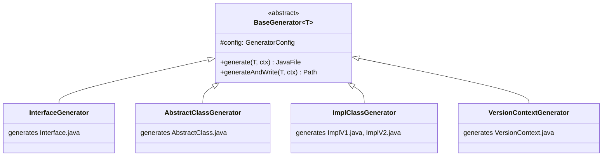
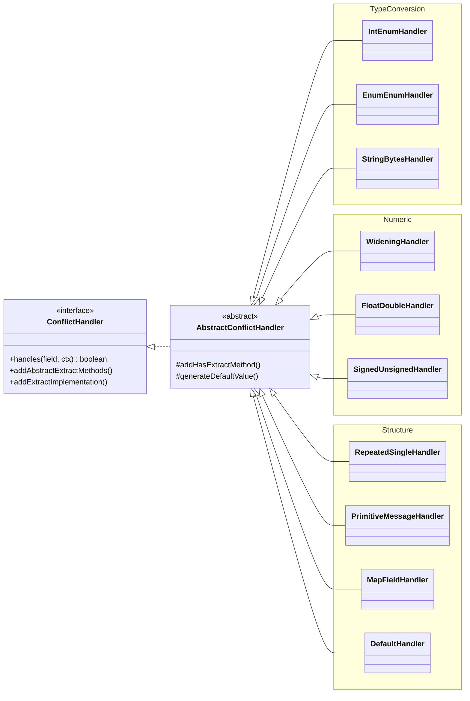
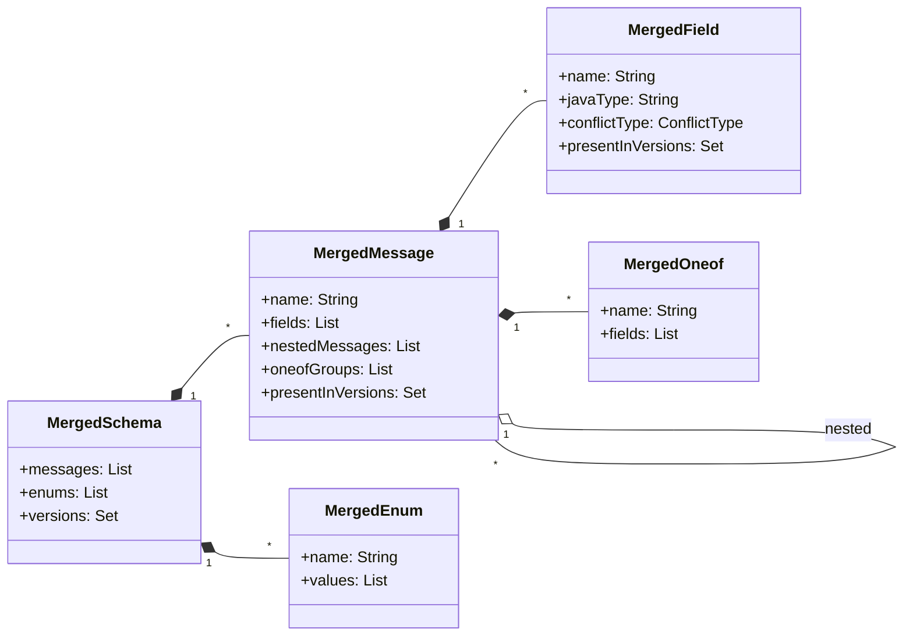
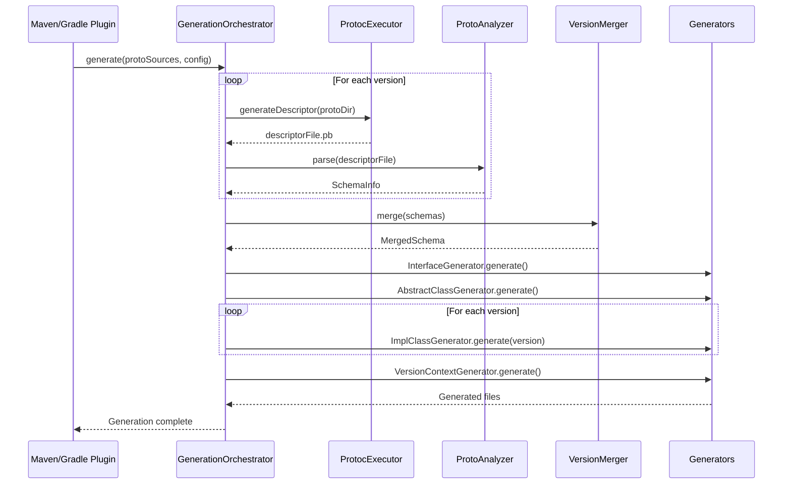
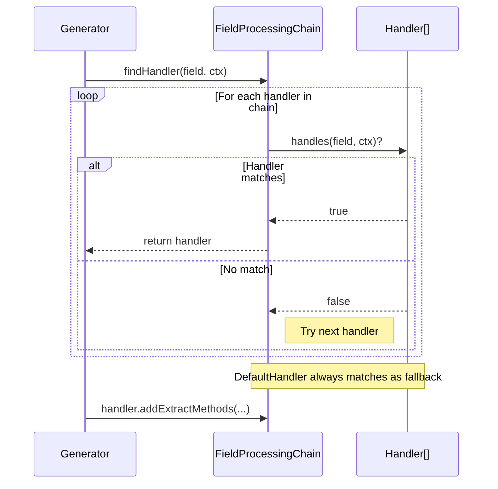
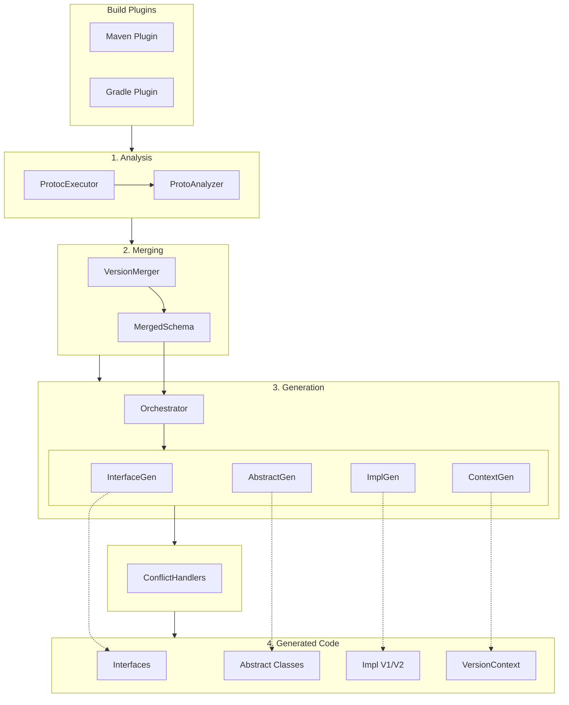

# Proto Wrapper Plugin Architecture

Version: 1.2.0
Last Updated: 2025-12-31

## Overview

Proto Wrapper Plugin generates version-agnostic Java wrapper classes from multiple protobuf schema versions. This document describes the internal architecture, design patterns, and code organization.

---

## Module Structure

```
proto-wrapper-plugin/
  proto-wrapper-core/           # Core library (shared)
  proto-wrapper-maven-plugin/   # Maven plugin wrapper
  proto-wrapper-gradle-plugin/  # Gradle plugin wrapper (Kotlin)
  proto-wrapper-integration-tests/  # Integration tests
  examples/
    maven-example/              # Example Maven project
    gradle-example/             # Example Gradle project
```

---

## Package Structure (proto-wrapper-core)

```
space.alnovis.protowrapper
  analyzer/         # Proto file parsing via protoc
  generator/        # Code generation (main package)
    builder/        # Builder interface generation
    conflict/       # Type conflict handling (Chain of Responsibility)
    oneof/          # Oneof field generation
    visitor/        # Message traversal (Visitor pattern)
  merger/           # Version schema merging
  model/            # Domain model classes
```

### Package Responsibilities

| Package | Responsibility |
|---------|---------------|
| `analyzer` | Parse `.proto` files using `protoc`, extract descriptors |
| `generator` | Generate Java source files using JavaPoet |
| `generator.builder` | Generate `Builder` interface nested in message interfaces |
| `generator.conflict` | Handle type conflicts between versions (INT_ENUM, WIDENING, etc.) |
| `generator.oneof` | Generate oneof Case enums and related methods |
| `generator.visitor` | Traverse message structures for analysis/generation |
| `merger` | Merge multiple version schemas into unified schema |
| `model` | Domain model: `MergedSchema`, `MergedMessage`, `MergedField`, etc. |

---

## Design Patterns

### 1. Template Method Pattern

**Location:** `AbstractClassGenerator` -> `ImplClassGenerator`

The abstract class defines the skeleton algorithm, while implementations provide version-specific details.

```
Interface (api package)
    |
AbstractClass (api.impl package)  <-- Template methods
    |
ImplClassV1, ImplClassV2 (v1, v2 packages)  <-- Concrete implementations
```

Generated code structure:
```java
// Template: AbstractMoney.java
public abstract class AbstractMoney<P> implements Money {
    protected abstract long extractBills(P proto);  // Template method

    @Override
    public final long getBills() {
        return extractBills(proto);  // Skeleton algorithm
    }
}

// Concrete: MoneyV1.java
public class MoneyV1 extends AbstractMoney<Common.Money> {
    @Override
    protected long extractBills(Common.Money proto) {
        return proto.getBills();  // Version-specific
    }
}
```

### 2. Chain of Responsibility Pattern

**Location:** `FieldProcessingChain` + `ConflictHandler` implementations

Field processing is delegated to appropriate handlers based on field characteristics.

```
FieldProcessingChain
    |-- IntEnumHandler        (INT_ENUM conflicts)
    |-- StringBytesHandler    (STRING_BYTES conflicts)
    |-- WideningHandler       (WIDENING conflicts)
    |-- PrimitiveMessageHandler (PRIMITIVE_MESSAGE conflicts)
    |-- RepeatedConflictHandler (repeated fields with conflicts)
    |-- MapFieldHandler       (map fields)
    |-- DefaultHandler        (fallback for all other fields)
```

Processing flow:
```java
public ConflictHandler findHandler(MergedField field, ProcessingContext ctx) {
    for (ConflictHandler handler : HANDLERS) {
        if (handler.handles(field, ctx)) {
            return handler;
        }
    }
    return DefaultHandler.INSTANCE;  // Fallback
}
```

### 3. Strategy Pattern

**Location:** `ConflictHandler` interface

Each handler implements a specific strategy for generating code for its field type.

```java
public sealed interface ConflictHandler permits
        IntEnumHandler, StringBytesHandler, WideningHandler,
        PrimitiveMessageHandler, RepeatedConflictHandler,
        MapFieldHandler, DefaultHandler {

    boolean handles(MergedField field, ProcessingContext ctx);
    void addAbstractExtractMethods(TypeSpec.Builder builder, MergedField field, ProcessingContext ctx);
    void addExtractImplementation(TypeSpec.Builder builder, MergedField field, boolean presentInVersion, ProcessingContext ctx);
    // ... more methods
}
```

### 4. Visitor Pattern

**Location:** `MessageVisitor` + `MessageTraverser`

Allows processing of message structures without modifying model classes.

```java
// Define what to do
MessageVisitor fieldCounter = new MessageVisitor() {
    private int count = 0;

    @Override
    public void visitField(MergedMessage message, MergedField field) {
        count++;
    }
};

// Traverse structure
MessageTraverser.traverse(schema, fieldCounter);
```

Traversal order:
1. `enterMessage(message)`
2. `visitField(message, field)` for each field
3. `visitNestedEnum(message, enum)` for each nested enum
4. Recursive traversal of nested messages
5. `exitMessage(message)`

### 5. Factory Pattern

**Location:** `VersionContext` interface (generated code)

Provides version-specific factory methods for creating wrappers.

```java
public interface VersionContext {
    <T> T wrap(Object proto);
    <T extends Money> T createMoney(Consumer<Money.Builder> initializer);
    // ...
}

// Usage:
VersionContext ctx = new VersionContextV1();
Money money = ctx.wrap(protoMoney);  // Factory creates correct impl
```

### 6. Sealed Types (Java 17+)

**Location:** `ConflictHandler`, `AbstractConflictHandler`

Sealed types provide:
- Compile-time exhaustiveness checking
- Documentation of all permitted implementations
- Prevention of accidental external extensions

```java
public sealed interface ConflictHandler permits
        IntEnumHandler, StringBytesHandler, WideningHandler,
        PrimitiveMessageHandler, RepeatedConflictHandler,
        MapFieldHandler, DefaultHandler { ... }

public abstract sealed class AbstractConflictHandler permits
        IntEnumHandler, StringBytesHandler, WideningHandler,
        PrimitiveMessageHandler, RepeatedConflictHandler,
        MapFieldHandler, DefaultHandler { ... }
```

### 7. Singleton Pattern

**Location:** `FieldProcessingChain`, Handler instances

Stateless handlers use singleton pattern for efficiency.

```java
public final class FieldProcessingChain {
    private static final FieldProcessingChain INSTANCE = new FieldProcessingChain();

    public static FieldProcessingChain getInstance() {
        return INSTANCE;
    }
}

public final class IntEnumHandler extends AbstractConflictHandler {
    public static final IntEnumHandler INSTANCE = new IntEnumHandler();
    private IntEnumHandler() {}
}
```

---

## Data Flow

```
.proto files (v1, v2, ...)
        |
        v
  ProtocExecutor          -- Execute protoc, get FileDescriptorSet
        |
        v
  ProtoAnalyzer           -- Extract MessageInfo, FieldInfo, EnumInfo
        |
        v
  VersionMerger           -- Merge schemas, detect conflicts
        |
        v
  MergedSchema            -- Unified model
        |
        v
  GenerationOrchestrator  -- Coordinate generation
        |
        +-- EnumGenerator         -> Enum.java
        +-- ConflictEnumGenerator -> ConflictEnum.java
        +-- InterfaceGenerator    -> Interface.java
        +-- AbstractClassGenerator -> AbstractClass.java
        +-- ImplClassGenerator    -> ImplClassVx.java
        +-- VersionContextGenerator -> VersionContext.java
```

---

## Class Diagrams

### Generator Hierarchy



### Conflict Handler Chain



### Model Classes



**ConflictType enum values:**
`NONE` | `INT_ENUM` | `ENUM_ENUM` | `WIDENING` | `FLOAT_DOUBLE` | `SIGNED_UNSIGNED` | `REPEATED_SINGLE` | `STRING_BYTES` | `PRIMITIVE_MESSAGE` | `OPTIONAL_REQUIRED` | `INCOMPATIBLE`

---

## Sequence Diagrams

### Generation Pipeline



### Field Processing Chain



**Handler priority order:**
1. IntEnumHandler, EnumEnumHandler, StringBytesHandler
2. WideningHandler, FloatDoubleHandler, SignedUnsignedHandler
3. RepeatedSingleHandler, PrimitiveMessageHandler, MapFieldHandler
4. DefaultHandler (fallback)

---

## Component Diagram



---

## Key Classes

### Entry Points

| Class | Purpose |
|-------|---------|
| `GenerationOrchestrator` | Coordinates all code generation |
| `VersionMerger` | Merges multiple schema versions |
| `ProtocExecutor` | Executes protoc compiler |

### Generators

| Class | Output |
|-------|--------|
| `InterfaceGenerator` | Version-agnostic interfaces |
| `AbstractClassGenerator` | Abstract classes with template methods |
| `ImplClassGenerator` | Version-specific implementations |
| `VersionContextGenerator` | VersionContext interface and impls |
| `EnumGenerator` | Enum classes |
| `ConflictEnumGenerator` | Conflict resolution enums |
| `BuilderInterfaceGenerator` | Builder interface (nested in message interface) |
| `OneofGenerator` | Oneof Case enums and methods |

### Model Classes

| Class | Purpose |
|-------|---------|
| `MergedSchema` | Container for all merged types |
| `MergedMessage` | Unified message with fields from all versions |
| `MergedField` | Field with version-specific info and conflict type |
| `MergedOneof` | Oneof group spanning versions |
| `MergedEnum` | Unified enum type |
| `FieldInfo` | Raw field info from proto descriptor |
| `MapInfo` | Map field key/value types |

---

## Configuration

`GeneratorConfig` controls generation behavior:

| Option | Default | Description |
|--------|---------|-------------|
| `apiPackage` | required | Package for interfaces and enums |
| `implPackagePattern` | `{api}.{version}` | Pattern for impl packages |
| `generateInterfaces` | true | Generate interface files |
| `generateAbstractClasses` | true | Generate abstract classes |
| `generateImplClasses` | true | Generate implementation classes |
| `generateVersionContext` | true | Generate VersionContext |
| `generateBuilders` | true | Generate Builder interfaces |

---

## Testing Strategy

### Unit Tests (proto-wrapper-core)
- Model class behavior
- Merger logic
- Individual generator components

### Integration Tests (proto-wrapper-integration-tests)
- Full generation pipeline
- Generated code compilation
- Runtime behavior of generated wrappers

### Example Tests (examples/maven-example)
- Real-world usage scenarios
- Cross-version operations
- Builder round-trip tests

---

## Extension Points

### Adding New Conflict Type

1. Add enum value to `MergedField.ConflictType`
2. Create new handler class extending `AbstractConflictHandler`
3. Add to `ConflictHandler` sealed interface permits clause
4. Add to `FieldProcessingChain.HANDLERS` list
5. Implement detection logic in `VersionMerger`

### Adding New Generator

1. Extend `BaseGenerator<T>` or implement `CodeGenerator<T>`
2. Implement `generate()` and `generateAndWrite()` methods
3. Add to `GenerationOrchestrator.generateAll()`
4. Add configuration flag to `GeneratorConfig` if needed
