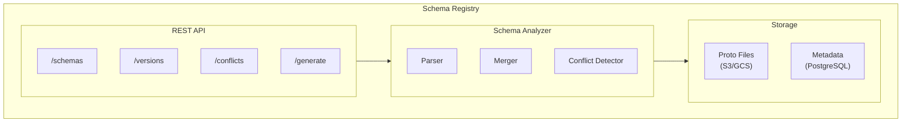

# Proto Wrapper Plugin Roadmap

Version: 2.1
Last Updated: 2026-01-20

This document outlines the development roadmap for upcoming releases.

---

## Table of Contents

### Java/JVM Releases (v1.x - v2.x)

- [Version 1.3.0](#version-130) - Well-Known Types Support (Completed)
- [Version 1.4.0](#version-140) - Repeated Conflict Field Builders (Completed)
- [Version 1.5.0](#version-150) - Schema Diff Tool (Completed)
- [Version 1.6.0](#version-160) - Incremental Generation (Completed)
- [Version 1.6.5](#version-165) - Embedded Protoc (Completed)
- [Version 1.6.6](#version-166) - ProtoWrapper Interface (Completed)
- [Version 1.6.7](#version-167) - Spring Boot Starter Core (Completed)
- [Version 1.6.8](#version-168) - VersionContext String API (Completed)
- [Version 1.6.9](#version-169) - ProtoWrapper String API (Completed)
- [Version 2.0.0](#version-200) - Breaking Changes Release (Completed)
- [Version 2.1.0](#version-210) - Parallel Generation
- [Version 2.2.0](#version-220) - Per-version Proto Syntax
- [Version 2.3.0](#version-230) - Validation Annotations
- [Version 2.4.0](#version-240) - Kotlin Extensions
- [Version 2.5.0](#version-250) - Service/RPC Wrappers
- [Version 2.6.0](#version-260) - Spring Boot Advanced
- [Version 2.7.0](#version-270) - buf.build Integration
- [Version 2.8.0](#version-280) - Quarkus Extension

### Multi-Language Support (v3.x)

- [Version 3.0.0](#version-300) - Go Support
- [Version 3.1.0](#version-310) - Language-Agnostic Schema Registry
- [Version 3.2.0](#version-320) - Proto-to-OpenAPI Generator

### Future

- [Future Considerations](#future-considerations)
- [Contributing](#contributing)

---

## Version 1.3.0 (Completed)

**Released:** January 2, 2026
**Theme:** Well-Known Types Support

### Feature: Well-Known Types Support

**Status:** Completed

#### Supported Types (15 total)

| Proto Type | Java Type | Notes |
|------------|-----------|-------|
| `google.protobuf.Timestamp` | `java.time.Instant` | Epoch-based |
| `google.protobuf.Duration` | `java.time.Duration` | Nanosecond precision |
| `google.protobuf.StringValue` | `String` | Nullable wrapper |
| `google.protobuf.Int32Value` | `Integer` | Nullable wrapper |
| `google.protobuf.Int64Value` | `Long` | Nullable wrapper |
| `google.protobuf.UInt32Value` | `Long` | Unsigned, nullable |
| `google.protobuf.UInt64Value` | `Long` | Unsigned, nullable |
| `google.protobuf.BoolValue` | `Boolean` | Nullable wrapper |
| `google.protobuf.FloatValue` | `Float` | Nullable wrapper |
| `google.protobuf.DoubleValue` | `Double` | Nullable wrapper |
| `google.protobuf.BytesValue` | `byte[]` | Nullable wrapper |
| `google.protobuf.FieldMask` | `List<String>` | Field paths |
| `google.protobuf.Struct` | `Map<String, Object>` | JSON-like |
| `google.protobuf.Value` | `Object` | Dynamic |
| `google.protobuf.ListValue` | `List<Object>` | Dynamic list |

#### Configuration Options

```xml
<configuration>
    <convertWellKnownTypes>true</convertWellKnownTypes>
    <generateRawProtoAccessors>false</generateRawProtoAccessors>
</configuration>
```

#### Implementation Details

- `WellKnownTypeInfo` - Enum registry with inline conversion code
- `WellKnownTypeHandler` - Handler for scalar WKT fields
- `RepeatedWellKnownTypeHandler` - Handler for repeated WKT fields
- `StructConverterGenerator` - Generates utility class for Struct/Value/ListValue

#### Acceptance Criteria

- [x] All 15 types converted automatically
- [x] Null handling for wrapper types
- [x] Builder setters accept Java types
- [x] Configuration option to disable
- [x] StructConverter utility class auto-generated when needed
- [x] Documentation updated

#### Not Supported

- `google.protobuf.Any` - Requires runtime type registry

---

## Version 1.4.0 (Completed)

**Released:** January 3, 2026
**Theme:** Repeated Conflict Field Builders

### Feature: Repeated Conflict Field Builders

**Status:** Completed

#### Description

Builder methods (add, addAll, set, clear) for repeated fields that have type conflicts across versions.

#### Supported Conflict Types

| Conflict | Example | Unified Type | Range Validation |
|----------|---------|--------------|------------------|
| WIDENING | repeated int32 vs int64 | List<Long> | Yes (int range) |
| FLOAT_DOUBLE | repeated float vs double | List<Double> | Yes (float range) |
| SIGNED_UNSIGNED | repeated int32 vs uint32 | List<Long> | Yes (signed/unsigned) |
| INT_ENUM | repeated int32 vs SomeEnum | List<Integer> | No |
| STRING_BYTES | repeated string vs bytes | List<String> | No (UTF-8 conversion) |

#### Generated Code Example

```java
interface RepeatedConflicts {
    List<Long> getNumbers();

    interface Builder {
        Builder addNumbers(long value);
        Builder addAllNumbers(List<Long> values);
        Builder setNumbers(List<Long> values);
        Builder clearNumbers();
    }
}

// V1 implementation with range validation
class RepeatedConflictsV1 {
    class BuilderImpl {
        @Override
        protected void doAddNumbers(long value) {
            if (value < Integer.MIN_VALUE || value > Integer.MAX_VALUE) {
                throw new IllegalArgumentException(
                    "Value " + value + " exceeds int32 range for v1");
            }
            protoBuilder.addNumbers((int) value);
        }
    }
}
```

#### Implementation Details

- `BuilderInterfaceGenerator.addRepeatedConflictBuilderMethods()` - generates interface methods
- `RepeatedConflictHandler.addAbstractBuilderMethods()` - generates abstract doXxx methods
- `RepeatedConflictHandler.addBuilderImplMethods()` - generates version-specific implementations
- `RepeatedConflictHandler.addConcreteBuilderMethods()` - generates public wrapper methods

#### Acceptance Criteria

- [x] All repeated conflict types have builder methods
- [x] Range validation with clear error messages
- [x] Type conversion handled correctly
- [x] Integration tests for all cases (35 tests in RepeatedConflictBuilderTest)
- [x] Documentation updated

### Migration Notes

- No breaking changes
- New feature is backward compatible

---

## Version 1.5.0 (Completed)

**Released:** January 4, 2026
**Theme:** Schema Diff Tool

### Feature: Schema Diff Tool

**Status:** Completed

#### Description

CLI and programmatic tool to compare proto schemas across versions and generate reports. Detects breaking changes for CI/CD integration.

#### CLI Usage

The CLI is packaged as an executable JAR (`proto-wrapper-core-1.5.0-cli.jar`).

```bash
# Basic comparison
java -jar proto-wrapper-core-1.5.0-cli.jar diff proto/v1 proto/v2

# Output formats
java -jar proto-wrapper-core-1.5.0-cli.jar diff proto/v1 proto/v2 --format=text
java -jar proto-wrapper-core-1.5.0-cli.jar diff proto/v1 proto/v2 --format=json
java -jar proto-wrapper-core-1.5.0-cli.jar diff proto/v1 proto/v2 --format=markdown

# Show only breaking changes
java -jar proto-wrapper-core-1.5.0-cli.jar diff proto/v1 proto/v2 --breaking-only

# CI/CD mode (exit code 1 on breaking changes)
java -jar proto-wrapper-core-1.5.0-cli.jar diff proto/v1 proto/v2 --fail-on-breaking

# Custom version names
java -jar proto-wrapper-core-1.5.0-cli.jar diff proto/v1 proto/v2 --v1-name=production --v2-name=development

# Quiet mode
java -jar proto-wrapper-core-1.5.0-cli.jar diff proto/v1 proto/v2 -q
```

#### CLI Options

| Option | Description |
|--------|-------------|
| `--v1-name=<name>` | Name for source version (default: v1) |
| `--v2-name=<name>` | Name for target version (default: v2) |
| `-f, --format=<fmt>` | Output format: text, json, markdown |
| `-o, --output=<file>` | Write output to file |
| `-b, --breaking-only` | Show only breaking changes |
| `--fail-on-breaking` | Exit code 1 on breaking changes |
| `--fail-on-warning` | Treat warnings as errors |
| `--protoc=<path>` | Path to protoc executable |
| `-q, --quiet` | Suppress informational messages |

#### Maven Goal

```bash
# Command line usage
mvn proto-wrapper:diff -Dv1=proto/v1 -Dv2=proto/v2
mvn proto-wrapper:diff -Dv1=proto/v1 -Dv2=proto/v2 -Dformat=markdown
mvn proto-wrapper:diff -Dv1=proto/v1 -Dv2=proto/v2 -DfailOnBreaking=true
```

```xml
<!-- pom.xml configuration -->
<execution>
    <id>check-breaking</id>
    <phase>verify</phase>
    <goals><goal>diff</goal></goals>
    <configuration>
        <v1>${basedir}/proto/production</v1>
        <v2>${basedir}/proto/development</v2>
        <v1Name>production</v1Name>
        <v2Name>development</v2Name>
        <outputFormat>markdown</outputFormat>
        <outputFile>${project.build.directory}/schema-diff.md</outputFile>
        <failOnBreaking>true</failOnBreaking>
    </configuration>
</execution>
```

#### Gradle Task

```kotlin
// Register diff task
tasks.register<io.alnovis.protowrapper.gradle.SchemaDiffTask>("diffSchemas") {
    v1Directory.set(file("proto/v1"))
    v2Directory.set(file("proto/v2"))
    v1Name.set("v1")
    v2Name.set("v2")
    outputFormat.set("markdown")
    outputFile.set(file("build/reports/schema-diff.md"))
    failOnBreaking.set(true)
}
```

```bash
./gradlew diffSchemas
```

#### Programmatic API

```java
SchemaDiff diff = SchemaDiff.compare(
    Path.of("proto/v1"),
    Path.of("proto/v2"),
    "v1",
    "v2"
);

// Query differences
diff.getAddedMessages();      // List<MessageInfo>
diff.getRemovedMessages();    // List<MessageInfo>
diff.getModifiedMessages();   // List<MessageDiff>

// Check breaking changes
diff.hasBreakingChanges();    // boolean
diff.getBreakingChanges();    // List<BreakingChange>

// Export
diff.toText();                // String
diff.toJson();                // String
diff.toMarkdown();            // String
```

#### Breaking Change Types

| Type | Severity | Description |
|------|----------|-------------|
| `MESSAGE_REMOVED` | ERROR | Message was removed |
| `FIELD_REMOVED` | ERROR | Field was removed |
| `FIELD_NUMBER_CHANGED` | ERROR | Field number changed |
| `FIELD_TYPE_INCOMPATIBLE` | ERROR | Incompatible type change |
| `ENUM_REMOVED` | ERROR | Enum was removed |
| `ENUM_VALUE_REMOVED` | ERROR | Enum value removed |
| `ENUM_VALUE_NUMBER_CHANGED` | ERROR | Enum value number changed |
| `REQUIRED_FIELD_ADDED` | WARNING | Required field added |
| `LABEL_CHANGED_TO_REQUIRED` | WARNING | Field changed to required |
| `CARDINALITY_CHANGED` | WARNING | Cardinality changed |
| `ONEOF_FIELD_MOVED` | WARNING | Field moved in/out of oneof |

#### Implementation Details

- `SchemaDiff` - Main facade for schema comparison
- `SchemaDiffEngine` - Core comparison logic
- `BreakingChangeDetector` - Breaking change identification
- `TextDiffFormatter` - Plain text output
- `JsonDiffFormatter` - JSON output
- `MarkdownDiffFormatter` - Markdown tables
- `SchemaDiffCli` - CLI entry point using picocli
- `DiffMojo` - Maven goal
- `SchemaDiffTask` - Gradle task

#### Acceptance Criteria

- [x] Detect all types of changes (added, modified, removed)
- [x] Identify breaking vs non-breaking changes
- [x] Multiple output formats (text, JSON, Markdown)
- [x] CLI tool with all options
- [x] Maven goal
- [x] Gradle task
- [x] Programmatic API
- [x] CI/CD integration (exit codes)
- [x] Integration tests

### Migration Notes

- No breaking changes
- Schema diff tool is a new optional feature
- CLI JAR available as `proto-wrapper-core-1.5.0-cli.jar`

---

## Version 1.6.0 (Completed)

**Released:** January 5, 2026
**Theme:** Incremental Generation

### Feature: Incremental Generation

**Status:** Completed

#### Description

Only regenerate wrappers when source proto files change, significantly reducing build times for large projects.

#### Configuration

```xml
<configuration>
    <incremental>true</incremental>  <!-- enabled by default -->
    <cacheDirectory>${project.build.directory}/proto-wrapper-cache</cacheDirectory>
    <forceRegenerate>false</forceRegenerate>
</configuration>
```

```kotlin
protoWrapper {
    incremental.set(true)  // enabled by default
    cacheDirectory.set(layout.buildDirectory.dir("proto-wrapper-cache"))
    forceRegenerate.set(false)
}
```

#### Command Line

```bash
# Force full regeneration
mvn compile -Dproto-wrapper.force=true
./gradlew generateProtoWrapper -Pproto-wrapper.force=true
```

#### Implementation Details

- `IncrementalState` - Persistent state model (JSON)
- `IncrementalStateManager` - Cache state management
- `ProtoDependencyGraph` - Proto import dependency graph
- `ChangeDetector` - Change detection logic
- `CacheLock` - File locking for thread safety

#### Acceptance Criteria

- [x] No regeneration when protos unchanged
- [x] Correct regeneration on proto change
- [x] Dependency-aware regeneration
- [x] Cache invalidation on config change
- [x] Measurable build time improvement (>50% for unchanged)
- [x] Works with both Maven and Gradle
- [x] `--force` flag to bypass cache

### Migration Notes

- No breaking changes
- Incremental generation enabled by default

---

## Version 1.6.5 (Completed)

**Released:** January 14, 2026
**Theme:** Embedded Protoc

### Feature: Automatic Protoc Download

**Status:** Completed

#### Description

The plugin now automatically downloads the appropriate `protoc` binary from Maven Central if not found in PATH. No manual protoc installation required.

#### Supported Platforms

| OS | Architecture |
|----|--------------|
| Linux | x86_64, aarch64 |
| macOS | x86_64, aarch64 (Apple Silicon) |
| Windows | x86_64 |

#### Cache Location

- Linux/macOS: `~/.cache/proto-wrapper/protoc/`
- Windows: `%LOCALAPPDATA%\proto-wrapper\protoc\`

#### Configuration

```xml
<configuration>
    <!-- Override protoc version (optional) -->
    <protocVersion>4.28.2</protocVersion>
</configuration>
```

#### Resolution Priority

1. Custom path (if `protocPath` is set)
2. System PATH (if protoc is installed)
3. Embedded (download from Maven Central)

#### Implementation Details

- `ProtocResolver` - Resolves protoc with priority chain
- Uses protobuf version from plugin's `protobuf-java` dependency by default

#### Acceptance Criteria

- [x] Auto-detect OS and architecture
- [x] Download from Maven Central
- [x] Cache for reuse
- [x] Override version via configuration
- [x] Fallback to system protoc if available

### Migration Notes

- No breaking changes
- `protocPath` parameter now optional

---

## Version 1.6.6 (Completed)

**Released:** January 16, 2026
**Theme:** ProtoWrapper Interface

### Feature: Common ProtoWrapper Interface

**Status:** Completed

#### Description

All generated wrapper classes now implement a common `ProtoWrapper` interface, enabling polymorphic wrapper handling without reflection.

#### Generated Interface

```java
public interface ProtoWrapper {
    Message getTypedProto();   // Access underlying proto
    int getWrapperVersion();   // Get protocol version
    byte[] toBytes();          // Serialize to bytes
}
```

#### Usage Example

```java
public void processAnyWrapper(ProtoWrapper wrapper) {
    int version = wrapper.getWrapperVersion();
    byte[] data = wrapper.toBytes();

    // Pattern matching (Java 17+)
    if (wrapper instanceof Order order) {
        processOrder(order);
    }
}

// Works with any generated wrapper
processAnyWrapper(order);
processAnyWrapper(payment);
processAnyWrapper(customer);
```

#### Implementation Details

- `ProtoWrapperGenerator` - Generates ProtoWrapper interface in API package
- All message interfaces extend `ProtoWrapper`
- `getTypedProto()` returns covariant type in implementations

#### Acceptance Criteria

- [x] ProtoWrapper interface generated
- [x] All interfaces extend ProtoWrapper
- [x] getTypedProto() returns correct type
- [x] Pattern matching works
- [x] Golden tests for all scenarios

### Migration Notes

- No breaking changes
- New interface is additive

---

## Version 1.6.7 (Completed)

**Released:** January 17, 2026
**Theme:** Spring Boot Starter (Core)

### Feature: Spring Boot Auto-Configuration (Core)

**Status:** Completed

#### Description

Basic Spring Boot Starter providing auto-configuration, properties binding, exception handling, and request-scoped VersionContext.

#### Components

| Component | Description |
|-----------|-------------|
| **ProtoWrapperProperties** | @ConfigurationProperties for application.yml binding |
| **ProtoWrapperAutoConfiguration** | Auto-configuration with conditional beans |
| **RequestScopedVersionContext** | Per-request VersionContext using @RequestScope |
| **VersionContextRequestFilter** | HTTP filter extracting version from headers |
| **ProtoWrapperExceptionHandler** | @ControllerAdvice for unified error handling |

#### Configuration

```yaml
# application.yml
proto-wrapper:
  base-package: com.example.model.api
  versions:
    - v1
    - v2
    - v3
  default-version: v2
  version-header: X-Protocol-Version
  request-scoped: true
  exception-handling: true
```

#### Generated Code Example

```java
@ConfigurationProperties(prefix = "proto-wrapper")
public class ProtoWrapperProperties {
    private String basePackage;
    private List<String> versions = List.of();
    private String defaultVersion;
    private String versionHeader = "X-Protocol-Version";
    private boolean requestScoped = true;
    private boolean exceptionHandling = true;
    // getters/setters
}
```

```java
@AutoConfiguration
@ConditionalOnClass(VersionContext.class)
@EnableConfigurationProperties(ProtoWrapperProperties.class)
public class ProtoWrapperAutoConfiguration {

    @Bean
    @ConditionalOnMissingBean
    public VersionContextProvider versionContextProvider(ProtoWrapperProperties props) {
        return new ReflectiveVersionContextProvider(props.getBasePackage(), props.getVersions());
    }

    @Bean
    @RequestScope
    @ConditionalOnProperty(name = "proto-wrapper.request-scoped", havingValue = "true", matchIfMissing = true)
    public RequestScopedVersionContext requestScopedVersionContext() {
        return new RequestScopedVersionContext();
    }

    @Bean
    @ConditionalOnProperty(name = "proto-wrapper.request-scoped", havingValue = "true", matchIfMissing = true)
    public FilterRegistrationBean<VersionContextRequestFilter> versionContextFilter(
            RequestScopedVersionContext ctx, VersionContextProvider provider, ProtoWrapperProperties props) {
        FilterRegistrationBean<VersionContextRequestFilter> registration = new FilterRegistrationBean<>();
        registration.setFilter(new VersionContextRequestFilter(ctx, provider, props));
        registration.addUrlPatterns("/*");
        registration.setOrder(Ordered.HIGHEST_PRECEDENCE + 10);
        return registration;
    }

    @Bean
    @ConditionalOnProperty(name = "proto-wrapper.exception-handling", havingValue = "true", matchIfMissing = true)
    public ProtoWrapperExceptionHandler protoWrapperExceptionHandler() {
        return new ProtoWrapperExceptionHandler();
    }
}
```

#### Usage Example

```java
@RestController
@RequestMapping("/api/orders")
public class OrderController {

    private final RequestScopedVersionContext versionContext;

    public OrderController(RequestScopedVersionContext versionContext) {
        this.versionContext = versionContext;
    }

    @PostMapping
    public Order createOrder(@RequestBody byte[] protoBytes) {
        // VersionContext automatically set from X-Protocol-Version header
        return versionContext.get().wrapOrder(protoBytes);
    }

    @GetMapping("/{id}")
    public ResponseEntity<byte[]> getOrder(@PathVariable String id) {
        Order order = orderService.findById(id);
        return ResponseEntity.ok()
            .header("X-Protocol-Version", String.valueOf(order.getWrapperVersion()))
            .body(order.toBytes());
    }
}
```

#### Exception Handling

```java
@ControllerAdvice
public class ProtoWrapperExceptionHandler {

    @ExceptionHandler(VersionNotSupportedException.class)
    public ResponseEntity<ProtoWrapperErrorResponse> handleVersionNotSupported(
            VersionNotSupportedException ex) {
        return ResponseEntity.status(HttpStatus.BAD_REQUEST)
            .body(new ProtoWrapperErrorResponse(
                "VERSION_NOT_SUPPORTED",
                ex.getMessage(),
                Map.of("requestedVersion", ex.getRequestedVersion(),
                       "supportedVersions", ex.getSupportedVersions())
            ));
    }

    @ExceptionHandler(ConversionException.class)
    public ResponseEntity<ProtoWrapperErrorResponse> handleConversionError(
            ConversionException ex) {
        return ResponseEntity.status(HttpStatus.UNPROCESSABLE_ENTITY)
            .body(new ProtoWrapperErrorResponse(
                "CONVERSION_ERROR",
                ex.getMessage(),
                Map.of("sourceVersion", ex.getSourceVersion(),
                       "targetVersion", ex.getTargetVersion())
            ));
    }

    @ExceptionHandler(ProtoWrapperException.class)
    public ResponseEntity<ProtoWrapperErrorResponse> handleGenericError(
            ProtoWrapperException ex) {
        return ResponseEntity.status(HttpStatus.INTERNAL_SERVER_ERROR)
            .body(new ProtoWrapperErrorResponse(
                "PROTO_WRAPPER_ERROR",
                ex.getMessage(),
                Collections.emptyMap()
            ));
    }
}

public record ProtoWrapperErrorResponse(
    String errorCode,
    String message,
    Map<String, Object> details
) {}
```

#### Module Structure

```
proto-wrapper-spring-boot-starter/
├── src/main/java/
│   └── io/alnovis/protowrapper/spring/
│       ├── ProtoWrapperAutoConfiguration.java
│       ├── ProtoWrapperProperties.java
│       ├── RequestScopedVersionContext.java
│       ├── VersionContextRequestFilter.java
│       ├── VersionContextProvider.java
│       ├── ReflectiveVersionContextProvider.java
│       ├── ProtoWrapperExceptionHandler.java
│       └── ProtoWrapperErrorResponse.java
├── src/main/resources/
│   └── META-INF/
│       └── spring/
│           └── org.springframework.boot.autoconfigure.AutoConfiguration.imports
└── pom.xml

examples/spring-boot-example/
├── src/main/java/
│   └── com/example/demo/
│       ├── DemoApplication.java
│       ├── controller/
│       │   └── OrderController.java
│       └── service/
│           └── OrderService.java
├── src/main/resources/
│   ├── application.yml
│   └── proto/
│       ├── v1/order.proto
│       └── v2/order.proto
├── src/test/java/
│   └── com/example/demo/
│       └── OrderControllerTest.java
└── pom.xml
```

#### Acceptance Criteria

- [ ] ProtoWrapperProperties with all configuration options
- [ ] Auto-configuration with conditional beans
- [ ] RequestScopedVersionContext component
- [ ] VersionContextRequestFilter for HTTP header extraction
- [ ] ProtoWrapperExceptionHandler with handlers for all exceptions
- [ ] Integration tests with Spring Boot 3.x
- [ ] Example project in examples/spring-boot-example/
- [ ] Documentation and examples

### Migration Notes

- No breaking changes
- New optional module
- Requires Spring Boot 3.0+
- Advanced features (actuator, metrics) planned for v2.6.0

---

## Version 1.6.8 (Completed)

**Released:** January 18, 2026
**Theme:** VersionContext String API

### Feature: String-based VersionContext API

**Status:** Completed

#### Description

Added string-based version identifiers to VersionContext interface, enabling support for non-numeric version names.

#### New Methods

```java
// New primary methods
static VersionContext forVersionId(String versionId);  // "v1", "v2", "legacy"
static Optional<VersionContext> find(String versionId);
String getVersionId();  // Returns "v1", "v2", etc.

// Deprecated (removed in 2.0.0)
@Deprecated static VersionContext forVersion(int version);
@Deprecated int getVersion();
```

#### Acceptance Criteria

- [x] forVersionId(String) method
- [x] find(String) method returning Optional
- [x] getVersionId() instance method
- [x] Deprecated integer-based methods
- [x] Tests updated

### Migration Notes

- No breaking changes
- Integer-based methods deprecated

---

## Version 1.6.9 (Completed)

**Released:** January 19, 2026
**Theme:** ProtoWrapper String API

### Feature: String-based ProtoWrapper API

**Status:** Completed

#### Description

Extended string-based version identifiers to ProtoWrapper interface and builders.

#### New Methods

```java
// ProtoWrapper interface
String getWrapperVersionId();  // Returns "v1", "v2", etc.

// Builder interface
String getVersionId();  // Version of builder

// Deprecated (removed in 2.0.0)
@Deprecated int getWrapperVersion();
@Deprecated int extractWrapperVersion();
```

#### Acceptance Criteria

- [x] getWrapperVersionId() on ProtoWrapper
- [x] extractWrapperVersionId() in abstract classes
- [x] getVersionId() in builders
- [x] Deprecated integer-based methods
- [x] Tests updated

### Migration Notes

- No breaking changes
- Integer-based methods deprecated, marked for removal

---

## Version 2.0.0 (Completed)

**Released:** January 20, 2026
**Theme:** Breaking Changes Release

### Breaking Changes

All deprecated integer-based version methods have been removed.

#### Removed Methods

| Interface | Removed Method | Replacement |
|-----------|---------------|-------------|
| `ProtoWrapper` | `getWrapperVersion()` | `getWrapperVersionId()` |
| `ProtoWrapper` | `extractWrapperVersion()` | `extractWrapperVersionId()` |
| `VersionContext` | `getVersion()` | `getVersionId()` |
| `VersionContext` | `forVersion(int)` | `forVersionId(String)` |
| `Builder` | `getVersion()` | `getVersionId()` |

#### Internal API Removed

| Class | Removed Method | Replacement |
|-------|---------------|-------------|
| `GeneratorUtils` | `buildNumericVersionCheck()` | `buildVersionCheck()` |

### Migration Guide

```java
// Before (1.6.x)
int version = wrapper.getWrapperVersion();
VersionContext ctx = VersionContext.forVersion(1);
if (ctx.getVersion() == 2) { ... }

// After (2.0.0)
String versionId = wrapper.getWrapperVersionId();  // "v1", "v2", etc.
VersionContext ctx = VersionContext.forVersionId("v1");
if ("v2".equals(ctx.getVersionId())) { ... }
```

### Benefits

- **Custom version names**: Supports non-numeric versions like `"legacy"`, `"v2beta"`, `"production"`
- **Consistency**: Single API style across all interfaces
- **Reliability**: No ambiguity with version number extraction from strings

### Acceptance Criteria

- [x] All deprecated methods removed
- [x] All tests updated to use new API
- [x] Documentation updated
- [x] CHANGELOG updated

---

## Version 2.1.0

**Target:** Mar 2026
**Theme:** Parallel Generation

### Feature: Parallel Generation

**Priority:** Medium
**Complexity:** Low

#### Description

Generate wrapper classes in parallel to improve build performance for large schemas.

#### Implementation

```java
public class ParallelGenerationOrchestrator {
    private final ExecutorService executor;

    public void generateAll(MergedSchema schema, GeneratorConfig config) {
        List<CompletableFuture<Void>> futures = new ArrayList<>();

        // Generate messages in parallel
        for (MergedMessage message : schema.getMessages()) {
            futures.add(CompletableFuture.runAsync(() ->
                generateMessage(message, config), executor));
        }

        // Wait for all
        CompletableFuture.allOf(futures.toArray(new CompletableFuture[0])).join();

        // Generate VersionContext (depends on all messages)
        generateVersionContext(schema, config);
    }
}
```

#### Configuration

```xml
<configuration>
    <parallelGeneration>true</parallelGeneration>
    <generationThreads>4</generationThreads> <!-- 0 = auto -->
</configuration>
```

#### Acceptance Criteria

- [ ] Thread-safe generation
- [ ] Configurable thread count
- [ ] No race conditions in file writing
- [ ] Measurable performance improvement
- [ ] Proper error handling and reporting

### Migration Notes

- No breaking changes
- New feature is opt-in

---

## Version 2.2.0

**Target:** Mar 2026
**Theme:** Per-version Proto Syntax

### Feature: Per-version Proto Syntax

**Priority:** High
**Complexity:** Medium

#### Description

Support mixed proto2/proto3 syntax across different protocol versions. Each version can specify its own protobuf syntax, enabling migration scenarios.

#### Problem

Current limitation: global `protobufMajorVersion` setting doesn't work for projects migrating from proto2 to proto3.

```xml
<!-- Current: global setting -->
<configuration>
    <protobufMajorVersion>3</protobufMajorVersion>  <!-- Applies to all versions -->
</configuration>
```

#### Solution

Per-version syntax configuration:

```xml
<versions>
    <version>
        <protoDir>v1</protoDir>
        <protoSyntax>proto2</protoSyntax>
    </version>
    <version>
        <protoDir>v2</protoDir>
        <protoSyntax>proto3</protoSyntax>
    </version>
</versions>
```

```kotlin
protoWrapper {
    versions {
        version("v1") {
            protoDir = "v1"
            protoSyntax = ProtoSyntax.PROTO2
        }
        version("v2") {
            protoDir = "v2"
            protoSyntax = ProtoSyntax.PROTO3
        }
    }
}
```

#### Syntax Differences Handled

| Aspect | proto2 | proto3 | Generated Code |
|--------|--------|--------|----------------|
| Enum conversion | `valueOf(int)` | `forNumber(int)` | Per-version method |
| Required fields | Supported | Not supported | `@NotNull` for proto2 |
| hasXxx() | All fields | Message/optional only | Conditional generation |
| Default values | Custom | Zero values | Documented in JavaDoc |
| Optional keyword | Explicit | Implicit (+ explicit) | Unified handling |

#### Generated Code Example

```java
// Proto2 version (v1)
public class MoneyV1 extends AbstractMoney<V1Money> {
    // Uses valueOf() for enum conversion
    @Override
    protected Currency extractCurrency(V1Money proto) {
        return Currency.valueOf(proto.getCurrency().getNumber());
    }

    // hasXxx for all fields (proto2 behavior)
    @Override
    protected boolean extractHasAmount(V1Money proto) {
        return proto.hasAmount();
    }
}

// Proto3 version (v2)
public class MoneyV2 extends AbstractMoney<V2Money> {
    // Uses forNumber() for enum conversion
    @Override
    protected Currency extractCurrency(V2Money proto) {
        return Currency.forNumber(proto.getCurrency().getNumber());
    }

    // hasXxx only for message fields (proto3 behavior)
    @Override
    protected boolean extractHasAmount(V2Money proto) {
        return true;  // Scalar always "present" in proto3
    }
}
```

#### Implementation Plan

1. Add `protoSyntax` field to `VersionConfig`:
   ```java
   public enum ProtoSyntax { PROTO2, PROTO3, AUTO }

   public class VersionConfig {
       private String protoDir;
       private ProtoSyntax protoSyntax = ProtoSyntax.AUTO;
   }
   ```

2. Auto-detection from .proto files:
   ```java
   // Parse first line: syntax = "proto3";
   public ProtoSyntax detectSyntax(Path protoFile) {
       String firstLine = Files.readFirstLine(protoFile);
       if (firstLine.contains("proto3")) return PROTO3;
       return PROTO2;  // Default for proto2
   }
   ```

3. Update `ImplClassGenerator`:
   - Pass syntax to handler context
   - Generate version-appropriate enum conversion
   - Generate version-appropriate hasXxx methods

4. Update `VersionMerger`:
   - Track syntax per version
   - Consider syntax in conflict detection

5. Deprecate global `protobufMajorVersion`:
   ```java
   @Deprecated(since = "1.8.0", forRemoval = true)
   private int protobufMajorVersion;
   ```

#### Acceptance Criteria

- [ ] Per-version protoSyntax configuration
- [ ] Auto-detection from .proto files
- [ ] Correct enum conversion per syntax
- [ ] Correct hasXxx generation per syntax
- [ ] Mixed proto2/proto3 integration tests
- [ ] Deprecation of global protobufMajorVersion
- [ ] Migration documentation

### Migration Notes

- No breaking changes
- New feature is opt-in
- Global `protobufMajorVersion` deprecated

---

## Version 2.3.0

**Target:** Apr 2026
**Theme:** Validation Annotations

### Feature: Validation Annotations

**Priority:** High
**Complexity:** Medium

#### Description

Generate Bean Validation (JSR-380) annotations on wrapper interfaces based on proto constraints and conventions.

#### Supported Annotations

| Annotation | Proto Source | Example |
|------------|--------------|---------|
| `@NotNull` | Required fields, non-optional | `required string id = 1;` |
| `@Size` | Repeated fields | `repeated Item items = 2; // @Size(min=1)` |
| `@Min/@Max` | Field options (custom) | `int32 age = 3 [(validate.min) = 0];` |
| `@Pattern` | Field options (custom) | `string email = 4 [(validate.pattern) = "..."];` |
| `@Valid` | Message fields | Nested message validation |

#### Generated Code Example

```java
public interface Order {
    @NotNull
    @Size(min = 1, max = 50)
    String getOrderId();

    @NotNull
    @Size(min = 1, message = "Order must have at least one item")
    List<@Valid OrderItem> getItems();

    @Min(0)
    long getTotalAmount();

    @Valid
    @NotNull
    Customer getCustomer();
}
```

#### Configuration

```xml
<configuration>
    <generateValidationAnnotations>true</generateValidationAnnotations>
    <validationAnnotationStyle>javax</validationAnnotationStyle> <!-- or jakarta -->
</configuration>
```

#### Implementation Plan

1. Add dependency on validation API (provided scope)
2. Create `ValidationAnnotationGenerator`:
   - Analyze field characteristics
   - Generate appropriate annotations
3. Support both `javax.validation` and `jakarta.validation`
4. Custom proto options for explicit constraints:
   ```protobuf
   import "validate/validate.proto";

   message User {
       string email = 1 [(validate.pattern) = "^[a-zA-Z0-9+_.-]+@[a-zA-Z0-9.-]+$"];
       int32 age = 2 [(validate.min) = 0, (validate.max) = 150];
   }
   ```

#### Acceptance Criteria

- [ ] @NotNull on required/non-optional fields
- [ ] @Size on repeated fields
- [ ] @Valid on message fields
- [ ] Support for javax and jakarta namespaces
- [ ] Optional custom proto options
- [ ] Configuration to enable/disable
- [ ] Integration with Spring Validation

### Migration Notes

- No breaking changes
- New feature is opt-in
- Validation annotations require adding validation API dependency

---

## Version 2.4.0

**Target:** May 2026
**Theme:** Kotlin Extensions

### Feature: Kotlin Extensions

**Priority:** High
**Complexity:** High

#### Description

Generate Kotlin-idiomatic wrappers with DSL builders, extension functions, and null-safe accessors.

#### Generated Code Example

```kotlin
// Generated Kotlin interface
interface Order {
    val orderId: String
    val items: List<OrderItem>
    val customer: Customer
    val totalAmount: Long
    val shippingAddress: Address?  // Nullable for optional

    fun toBuilder(): Builder

    interface Builder {
        var orderId: String
        var customer: Customer
        var totalAmount: Long
        var shippingAddress: Address?

        fun addItem(item: OrderItem): Builder
        fun items(block: MutableList<OrderItem>.() -> Unit): Builder
        fun customer(block: Customer.Builder.() -> Unit): Builder

        fun build(): Order
    }

    companion object {
        fun build(ctx: VersionContext, block: Builder.() -> Unit): Order
    }
}

// DSL Usage
val order = Order.build(ctx) {
    orderId = "ORD-001"
    totalAmount = 5000

    customer {
        name = "John Doe"
        email = "john@example.com"
    }

    items {
        add(OrderItem.build(ctx) {
            productId = "PROD-001"
            quantity = 2
        })
    }

    shippingAddress = Address.build(ctx) {
        street = "123 Main St"
        city = "Boston"
    }
}
```

#### Extension Functions

```kotlin
// Generated extensions
fun Order.formatted(): String =
    "Order ${orderId}: ${items.size} items, total: $${totalAmount / 100.0}"

fun Money.formatted(locale: Locale = Locale.getDefault()): String =
    NumberFormat.getCurrencyInstance(locale).format(amount / 100.0)

// Null-safe conversions
fun Order.asV2OrNull(): OrderV2? =
    if (this is OrderV2) this else runCatching { asVersion(OrderV2::class.java) }.getOrNull()
```

#### Configuration

```kotlin
protoWrapper {
    kotlinExtensions {
        enabled = true
        generateDsl = true
        generateExtensions = true
        nullableOptionalFields = true
    }
}
```

#### Implementation Plan

1. Create `kotlin-extensions` submodule
2. Implement Kotlin code generators:
   - `KotlinInterfaceGenerator`
   - `KotlinBuilderGenerator`
   - `KotlinDslGenerator`
   - `KotlinExtensionGenerator`
3. Use KotlinPoet for code generation
4. Generate alongside Java (not replacing)
5. Add Gradle plugin configuration

#### Acceptance Criteria

- [ ] Kotlin interfaces with properties
- [ ] DSL builders
- [ ] Extension functions
- [ ] Null-safe optional fields
- [ ] Works alongside Java wrappers
- [ ] Gradle plugin support
- [ ] Documentation

### Migration Notes

- No breaking changes to Java API
- Kotlin extensions are additive

---

## Version 2.5.0

**Target:** Jun 2026
**Theme:** Service/RPC Wrappers

### Feature: Service/RPC Wrappers

**Priority:** Medium
**Complexity:** High

#### Description

Generate version-agnostic service interfaces from proto service definitions.

#### Proto Definition

```protobuf
service OrderService {
    rpc CreateOrder(CreateOrderRequest) returns (Order);
    rpc GetOrder(GetOrderRequest) returns (Order);
    rpc ListOrders(ListOrdersRequest) returns (stream Order);
    rpc UpdateOrder(stream UpdateOrderRequest) returns (Order);
}
```

#### Generated Code

```java
// Version-agnostic service interface
public interface OrderService {
    Order createOrder(CreateOrderRequest request);
    Order getOrder(GetOrderRequest request);
    Iterator<Order> listOrders(ListOrdersRequest request);  // Server streaming
    Order updateOrder(Iterator<UpdateOrderRequest> requests);  // Client streaming
}

// Async variant
public interface OrderServiceAsync {
    CompletableFuture<Order> createOrder(CreateOrderRequest request);
    CompletableFuture<Order> getOrder(GetOrderRequest request);
    Publisher<Order> listOrders(ListOrdersRequest request);  // Reactive
}

// gRPC adapter
public class OrderServiceGrpcAdapter implements OrderService {
    private final OrderServiceGrpc.OrderServiceBlockingStub stub;
    private final VersionContext ctx;

    @Override
    public Order createOrder(CreateOrderRequest request) {
        var protoRequest = toProto(request);
        var protoResponse = stub.createOrder(protoRequest);
        return ctx.wrapOrder(protoResponse);
    }
}
```

#### Implementation Plan

1. Parse service definitions from proto
2. Generate service interfaces
3. Generate gRPC adapters (optional)
4. Support streaming methods
5. Async/reactive variants

#### Acceptance Criteria

- [ ] Service interface generation
- [ ] All RPC types (unary, streaming)
- [ ] gRPC adapter generation
- [ ] Async variants
- [ ] Version-agnostic wrappers for request/response

### Migration Notes

- No breaking changes
- Service wrappers are a new optional feature

---

## Version 2.6.0

**Target:** Aug 2026
**Theme:** Spring Boot Advanced

### Feature: Spring Boot Advanced Features

**Priority:** Medium
**Complexity:** Medium

#### Description

Advanced Spring Boot integration features building on the core starter from v1.6.7. Adds Actuator health indicator, Micrometer metrics, @Qualifier support for specific version injection, and enhanced monitoring capabilities.

> **Note:** Core Spring Boot Starter functionality (auto-configuration, properties, exception handling, request-scoped context) was released in v1.6.7 to enable early adoption during KZ project migration.

#### Prerequisites

- proto-wrapper-spring-boot-starter v1.6.7+ (core functionality)
- Spring Boot 3.0+
- Spring Boot Actuator (optional, for health/metrics)

#### Features (v2.1.0 additions)

| Feature | Description |
|---------|-------------|
| **Health indicator** | Actuator endpoint for version info |
| **Metrics** | Micrometer metrics for wrapper usage |
| **@Qualifier injection** | Inject specific versions by qualifier |
| **Version statistics** | Track wrapper usage by type and version |
| **Named beans** | Register each version as a named bean |

#### @Qualifier Support

```java
@Service
public class OrderService {
    @Autowired
    private VersionContext versionContext;  // Default version

    @Autowired
    @Qualifier("v3")
    private VersionContext v3Context;  // Specific version
}
```

#### Actuator Endpoint

```bash
GET /actuator/proto-wrapper

{
  "defaultVersion": "v2",
  "availableVersions": ["v1", "v2", "v3"],
  "wrapperStats": {
    "totalWrapped": 15420,
    "byType": {
      "Order": 5230,
      "Payment": 4120,
      "Customer": 6070
    }
  }
}
```

#### Micrometer Metrics

```
proto_wrapper_wrap_total{type="Order",version="v2"} 5230
proto_wrapper_wrap_total{type="Payment",version="v2"} 4120
proto_wrapper_wrap_duration_seconds{type="Order",quantile="0.95"} 0.002
proto_wrapper_conversion_errors_total{from="v1",to="v3"} 12
```

#### Additional Components

```
proto-wrapper-spring-boot-starter/
├── src/main/java/
│   └── io/alnovis/protowrapper/spring/
│       ├── ... (core from v1.6.7)
│       ├── ProtoWrapperHealthIndicator.java    # v2.1.0
│       ├── ProtoWrapperMetrics.java            # v2.1.0
│       ├── VersionBeanRegistrar.java           # v2.1.0
│       └── actuator/
│           ├── ProtoWrapperEndpoint.java       # v2.1.0
│           └── ProtoWrapperEndpointAutoConfiguration.java
└── pom.xml
```

#### Configuration

```yaml
# application.yml
proto-wrapper:
  # Core settings (v1.6.7)
  base-package: com.example.model.api
  versions:
    - v1
    - v2
    - v3
  default-version: v2

  # Advanced settings (v2.1.0)
  actuator:
    enabled: true
    endpoint-id: proto-wrapper
  metrics:
    enabled: true
    prefix: proto_wrapper
    track-by-type: true
    track-by-version: true
  qualifier-injection:
    enabled: true
```

#### Acceptance Criteria

- [ ] @Qualifier support for version-specific injection
- [ ] Actuator health indicator
- [ ] Micrometer metrics integration
- [ ] Custom actuator endpoint
- [ ] Named bean registration for each version
- [ ] Usage statistics tracking
- [ ] Documentation and examples

### Migration Notes

- No breaking changes
- Builds on v1.6.7 core starter
- Actuator/metrics features are optional
- Requires Spring Boot Actuator for health/metrics features

---

## Version 2.7.0

**Target:** Sep 2026
**Theme:** buf.build Integration

### Feature: buf.build Plugin

**Priority:** High
**Complexity:** Medium

#### Description

Integrate with [buf.build](https://buf.build) ecosystem - the modern standard for Protobuf management. Provide a buf plugin for wrapper generation, integrate with BSR (Buf Schema Registry), and enhance schema diff with buf compatibility.

#### Why buf.build?

| Aspect | Traditional | buf.build |
|--------|-------------|-----------|
| Linting | Manual protoc flags | `buf lint` with configurable rules |
| Breaking detection | Custom tooling | `buf breaking` built-in |
| Dependencies | Copy proto files | `buf.yaml` dependency management |
| Registry | None | BSR (Buf Schema Registry) |
| Generation | protoc plugins | `buf generate` with plugins |

#### buf Plugin

```yaml
# buf.gen.yaml
version: v1
plugins:
  - plugin: buf.build/alnovis/proto-wrapper
    out: gen/java
    opt:
      - basePackage=com.example.model
      - generateBuilders=true
      - versions=v1,v2,v3
```

```bash
# Generate wrappers
buf generate
```

#### BSR Integration

```yaml
# buf.yaml
version: v1
deps:
  - buf.build/googleapis/googleapis
  - buf.build/example/my-proto:v2  # Your versioned schemas
  - buf.build/example/my-proto:v3
```

```java
// Reference schemas from BSR
protoWrapper {
    bsr {
        modules = [
            "buf.build/example/my-proto:v2",
            "buf.build/example/my-proto:v3"
        ]
    }
}
```

#### Enhanced Schema Diff

Align with buf breaking change detection:

```bash
# Use buf-compatible breaking change rules
proto-wrapper diff --buf-compatible proto/v1 proto/v2

# Output matches buf breaking format
proto/v2/order.proto:15:3: Field "2" on message "Order" changed type from "int32" to "int64".
```

#### buf Plugin Implementation

```go
// cmd/protoc-gen-proto-wrapper/main.go
package main

import (
    "google.golang.org/protobuf/compiler/protogen"
)

func main() {
    protogen.Options{}.Run(func(gen *protogen.Plugin) error {
        // Generate wrapper metadata
        // Actual Java generation delegated to core library
        return generateWrapperSpec(gen)
    })
}
```

#### Workflow Integration

```yaml
# .github/workflows/proto.yml
name: Proto CI
on: [push, pull_request]

jobs:
  proto:
    runs-on: ubuntu-latest
    steps:
      - uses: actions/checkout@v4

      - uses: bufbuild/buf-setup-action@v1

      - name: Lint
        run: buf lint

      - name: Breaking changes
        run: buf breaking --against 'https://github.com/org/repo.git#branch=main'

      - name: Generate wrappers
        run: buf generate

      - name: Build Java
        run: mvn compile
```

#### Configuration

```xml
<!-- Maven plugin integration -->
<plugin>
    <groupId>io.alnovis</groupId>
    <artifactId>proto-wrapper-maven-plugin</artifactId>
    <configuration>
        <bufIntegration>
            <enabled>true</enabled>
            <bufConfigPath>buf.yaml</bufConfigPath>
            <useBufBreaking>true</useBufBreaking>
        </bufIntegration>
    </configuration>
</plugin>
```

#### Acceptance Criteria

- [ ] buf plugin for `buf generate`
- [ ] BSR module resolution
- [ ] buf-compatible breaking change output
- [ ] Integration with buf lint rules
- [ ] CI/CD workflow examples
- [ ] Documentation for buf migration

### Migration Notes

- No breaking changes
- buf integration is optional
- Existing Maven/Gradle workflows continue to work

---

## Version 2.8.0

**Target:** Oct 2026
**Theme:** Quarkus Extension

### Feature: Quarkus Extension

**Priority:** Medium
**Complexity:** Medium

#### Description

Native Quarkus extension for proto-wrapper with build-time optimization, GraalVM native image support, and CDI integration.

#### Why Quarkus?

- **Build-time processing**: Generate wrapper metadata at build time
- **Native images**: Full GraalVM native-image support
- **Fast startup**: Millisecond startup for serverless/containers
- **CDI**: Standard dependency injection

#### Extension Features

```java
@ApplicationScoped
public class OrderService {
    @Inject
    VersionContext versionContext;

    @Inject
    @ProtoVersion("v3")
    VersionContext v3Context;

    public Order processOrder(byte[] protoBytes) {
        return versionContext.wrapOrder(protoBytes);
    }
}
```

#### Configuration

```properties
# application.properties
quarkus.proto-wrapper.default-version=v2
quarkus.proto-wrapper.versions.v1.enabled=true
quarkus.proto-wrapper.versions.v2.enabled=true
quarkus.proto-wrapper.versions.v3.enabled=true
```

#### Native Image Support

```java
// Build-time registration for reflection
@BuildStep
ReflectiveClassBuildItem registerForReflection() {
    return new ReflectiveClassBuildItem(true, true,
        "com.example.model.api.Order",
        "com.example.model.v1.OrderV201",
        "com.example.model.v2.OrderV202"
    );
}
```

```bash
# Build native image
./mvnw package -Pnative

# Run with millisecond startup
./target/my-app-runner
# Started in 0.015s
```

#### Dev Mode Integration

```bash
# Hot reload for proto changes
./mvnw quarkus:dev

# Proto file change detected
# Regenerating wrappers...
# Hot reload complete
```

#### Module Structure

```
proto-wrapper-quarkus/
├── deployment/
│   └── src/main/java/
│       └── ProtoWrapperProcessor.java  # Build-time
├── runtime/
│   └── src/main/java/
│       ├── ProtoWrapperRecorder.java
│       └── ProtoVersionQualifier.java
└── integration-tests/
```

#### Acceptance Criteria

- [ ] CDI injection of VersionContext
- [ ] @ProtoVersion qualifier
- [ ] GraalVM native image support
- [ ] Build-time wrapper registration
- [ ] Dev mode hot reload
- [ ] Quarkus 3.x compatibility
- [ ] Documentation and quickstart

### Migration Notes

- No breaking changes
- New optional module
- Requires Quarkus 3.0+

---

## Version 3.0.0

**Target:** Q1 2027
**Theme:** Go Support

### Feature: Go Code Generation

**Priority:** High
**Complexity:** Very High

#### Description

Extend proto-wrapper to generate version-agnostic Go wrappers, enabling the same multi-version abstraction pattern in Go projects. This is a major milestone introducing multi-language support.

#### Why Go?

| Reason | Details |
|--------|---------|
| gRPC adoption | Go is the #2 language for gRPC after Java |
| Cloud native | Kubernetes, microservices heavily use Go |
| Proto tooling | Strong protobuf ecosystem in Go |
| User demand | Common request for polyglot environments |

#### Generated Go Code

```go
// api/order.go - Generated interface
package api

type Order interface {
    GetOrderId() string
    GetItems() []OrderItem
    GetTotalAmount() int64
    GetPaymentType() PaymentType      // Unified enum
    GetPaymentTypeInt() int32         // For INT_ENUM conflict

    ToProto() proto.Message
    ToBytes() []byte

    ToBuilder() OrderBuilder
}

type OrderBuilder interface {
    SetOrderId(string) OrderBuilder
    AddItem(OrderItem) OrderBuilder
    SetTotalAmount(int64) OrderBuilder
    Build() Order
}
```

```go
// v2/order_v2.go - Version implementation
package v2

type OrderV202 struct {
    proto *pb.Order
}

func (o *OrderV202) GetOrderId() string {
    return o.proto.GetOrderId()
}

func (o *OrderV202) GetTotalAmount() int64 {
    // Widening: v1 has int32, v2 has int64
    return o.proto.GetTotalAmount()
}

func (o *OrderV202) GetPaymentType() api.PaymentType {
    // INT_ENUM conflict resolution
    return api.PaymentType(o.proto.GetPaymentType())
}
```

```go
// Usage
package main

import (
    "github.com/example/model/api"
    "github.com/example/model/v2"
)

func main() {
    ctx := v2.NewVersionContext()

    // Wrap any version
    order := ctx.WrapOrder(protoBytes)

    // Version-agnostic access
    fmt.Printf("Order: %s, Total: %d\n",
        order.GetOrderId(),
        order.GetTotalAmount())

    // Build new message
    newOrder := ctx.NewOrderBuilder().
        SetOrderId("ORD-001").
        SetTotalAmount(5000).
        Build()
}
```

#### Architecture

```
proto-wrapper-go/
├── cmd/
│   └── protoc-gen-proto-wrapper-go/  # protoc plugin
│       └── main.go
├── pkg/
│   ├── generator/
│   │   ├── interface_generator.go
│   │   ├── impl_generator.go
│   │   └── conflict_handlers.go
│   ├── model/
│   │   ├── merged_schema.go
│   │   └── conflict_type.go
│   └── runtime/
│       └── wrapper.go               # Runtime utilities
├── internal/
│   └── parser/
│       └── proto_parser.go
└── go.mod
```

#### Conflict Handling in Go

| Conflict | Java | Go |
|----------|------|-----|
| INT_ENUM | Dual getters | Dual getters + type alias |
| WIDENING | Unified as wider | Unified as int64 |
| STRING_BYTES | Dual getters | `string` + `[]byte` getters |
| OPTIONAL | hasXxx() | Pointer types (*string) |

#### Configuration

```yaml
# buf.gen.yaml
version: v1
plugins:
  - plugin: buf.build/alnovis/proto-wrapper-go
    out: gen/go
    opt:
      - module=github.com/example/model
      - versions=v1,v2,v3
```

```bash
# Or standalone
protoc --proto-wrapper-go_out=. \
       --proto-wrapper-go_opt=module=github.com/example/model \
       proto/v1/*.proto proto/v2/*.proto
```

#### Implementation Phases

**Phase 1: Core Generator (v3.0.0)**
- [ ] Go interface generation
- [ ] Version implementation generation
- [ ] Basic conflict handling (INT_ENUM, WIDENING)
- [ ] protoc plugin

**Phase 2: Full Feature Parity (v3.0.1)**
- [ ] All conflict types
- [ ] Builder pattern
- [ ] Well-known types
- [ ] Oneof support

**Phase 3: Go Idioms (v3.0.2)**
- [ ] Error handling (return errors, not exceptions)
- [ ] Context support
- [ ] Functional options pattern
- [ ] go generate integration

#### Acceptance Criteria

- [ ] Generate Go interfaces from merged schema
- [ ] Handle all conflict types
- [ ] Builder pattern for Go
- [ ] protoc plugin
- [ ] buf plugin
- [ ] go generate support
- [ ] Comprehensive tests
- [ ] Documentation

### Migration Notes

- Major version bump (3.0.0) for multi-language support
- Java API unchanged
- Go is a new, parallel track

---

## Version 3.1.0

**Target:** Q2 2027
**Theme:** Language-Agnostic Schema Registry

### Feature: Schema Registry

**Priority:** High
**Complexity:** High

#### Description

A centralized, language-agnostic schema registry that stores versioned proto schemas with conflict metadata. Provides REST API for querying schema information, version compatibility, and wrapper generation metadata.

#### Why Schema Registry?

| Problem | Solution |
|---------|----------|
| Schema sprawl | Centralized storage |
| Version discovery | API to list versions |
| Conflict visibility | Pre-computed conflict info |
| Multi-language | Language-agnostic metadata |
| CI/CD integration | REST API for automation |

#### Architecture



#### REST API

```bash
# List all schemas
GET /api/v1/schemas
{
  "schemas": [
    {"name": "Order", "versions": ["v1", "v2", "v3"]},
    {"name": "Payment", "versions": ["v1", "v2"]}
  ]
}

# Get schema details
GET /api/v1/schemas/Order
{
  "name": "Order",
  "versions": {
    "v1": {"fields": 12, "lastModified": "2026-01-15"},
    "v2": {"fields": 15, "lastModified": "2026-03-20"},
    "v3": {"fields": 18, "lastModified": "2026-06-10"}
  },
  "conflicts": [
    {"field": "paymentType", "type": "INT_ENUM", "versions": ["v1", "v2"]},
    {"field": "totalAmount", "type": "WIDENING", "versions": ["v1", "v2", "v3"]}
  ]
}

# Get conflicts between versions
GET /api/v1/schemas/Order/conflicts?from=v1&to=v3
{
  "breaking": [
    {"type": "FIELD_REMOVED", "field": "legacyId", "severity": "ERROR"}
  ],
  "compatible": [
    {"type": "FIELD_ADDED", "field": "metadata", "severity": "INFO"}
  ]
}

# Generate wrapper metadata
POST /api/v1/generate
{
  "schemas": ["Order", "Payment"],
  "versions": ["v2", "v3"],
  "language": "java",
  "options": {"generateBuilders": true}
}

Response:
{
  "generationId": "abc123",
  "downloadUrl": "/api/v1/generate/abc123/download",
  "expiresAt": "2026-01-18T12:00:00Z"
}
```

#### Web UI

The registry includes a web interface for browsing schemas:

| Panel | Description |
|-------|-------------|
| **Schema List** | Browsable list of all registered schemas (Order, Payment, Customer, etc.) |
| **Version Details** | Available versions (v1, v2, v3) with field counts and timestamps |
| **Conflict View** | Visual display of detected conflicts (INT_ENUM, WIDENING, etc.) |
| **Actions** | Compare Versions, Generate Wrappers, Download Proto |
| **Search** | Full-text search across schemas and fields |

#### Docker Deployment

```yaml
# docker-compose.yml
version: '3.8'
services:
  registry:
    image: alnovis/proto-wrapper-registry:3.1.0
    ports:
      - "8080:8080"
    environment:
      - DATABASE_URL=postgres://user:pass@db:5432/registry
      - STORAGE_BACKEND=s3
      - S3_BUCKET=proto-schemas
    depends_on:
      - db

  db:
    image: postgres:15
    environment:
      - POSTGRES_DB=registry
      - POSTGRES_USER=user
      - POSTGRES_PASSWORD=pass
```

#### CLI Integration

```bash
# Push schemas to registry
proto-wrapper registry push \
  --url https://registry.example.com \
  --schema Order \
  --version v3 \
  proto/v3/order.proto

# Pull and generate
proto-wrapper registry generate \
  --url https://registry.example.com \
  --schemas Order,Payment \
  --versions v2,v3 \
  --language go \
  --output gen/
```

#### Acceptance Criteria

- [ ] REST API for schema management
- [ ] Version comparison endpoint
- [ ] Conflict analysis endpoint
- [ ] Multi-language generation endpoint
- [ ] Web UI for browsing
- [ ] Docker deployment
- [ ] CLI integration
- [ ] Authentication (API keys, OAuth)
- [ ] Webhook notifications

### Migration Notes

- New standalone service
- Optional component
- Can be self-hosted or cloud-hosted

---

## Version 3.2.0

**Target:** Q3 2027
**Theme:** Proto-to-OpenAPI Generator

### Feature: OpenAPI Specification Generation

**Priority:** Medium
**Complexity:** Medium

#### Description

Generate OpenAPI 3.x specifications from versioned proto schemas, enabling REST API documentation and client generation for non-gRPC consumers.

#### Use Cases

| Scenario | Description |
|----------|-------------|
| REST Gateway | Document gRPC-Gateway endpoints |
| API Documentation | Swagger UI for proto-based APIs |
| Client Generation | Generate REST clients (TypeScript, Python, etc.) |
| API Versioning | Document multiple API versions |

#### Generated OpenAPI

```yaml
# openapi.yaml (generated)
openapi: 3.0.3
info:
  title: Order API
  version: v2
  description: |
    Version-agnostic API generated from proto schemas.
    Supports versions: v1, v2, v3

paths:
  /api/v2/orders:
    post:
      summary: Create Order
      operationId: createOrder
      requestBody:
        content:
          application/json:
            schema:
              $ref: '#/components/schemas/Order'
      responses:
        '200':
          content:
            application/json:
              schema:
                $ref: '#/components/schemas/Order'

  /api/v2/orders/{orderId}:
    get:
      summary: Get Order
      parameters:
        - name: orderId
          in: path
          required: true
          schema:
            type: string

components:
  schemas:
    Order:
      type: object
      required:
        - orderId
        - items
      properties:
        orderId:
          type: string
          description: Unique order identifier
        items:
          type: array
          items:
            $ref: '#/components/schemas/OrderItem'
        totalAmount:
          type: integer
          format: int64
          description: |
            Total amount in cents.
            Note: Widened from int32 in v1 to int64 in v2+
        paymentType:
          oneOf:
            - type: integer
              description: Legacy int value (v1)
            - $ref: '#/components/schemas/PaymentType'
          description: |
            Payment type. INT_ENUM conflict:
            - v1: integer (1=CASH, 2=CARD)
            - v2+: PaymentType enum

    PaymentType:
      type: string
      enum: [CASH, CARD, CRYPTO, BANK_TRANSFER]
```

#### Conflict Documentation

```yaml
# Conflict handling documented in OpenAPI
components:
  schemas:
    Order:
      x-proto-wrapper:
        conflicts:
          - field: paymentType
            type: INT_ENUM
            description: |
              This field has different types across versions:
              - v1: int32 (1=CASH, 2=CARD, 3=CRYPTO)
              - v2+: PaymentType enum
            accessors:
              integer: getPaymentTypeInt()
              enum: getPaymentType()
          - field: totalAmount
            type: WIDENING
            description: Widened from int32 to int64 in v2
```

#### Configuration

```xml
<configuration>
    <openApi>
        <enabled>true</enabled>
        <outputFile>${project.build.directory}/openapi.yaml</outputFile>
        <format>yaml</format>  <!-- or json -->
        <includeConflictDocs>true</includeConflictDocs>
        <servers>
            <server>
                <url>https://api.example.com</url>
                <description>Production</description>
            </server>
        </servers>
    </openApi>
</configuration>
```

```bash
# Generate OpenAPI spec
mvn proto-wrapper:openapi

# Or via CLI
proto-wrapper openapi \
  --versions v1,v2,v3 \
  --output openapi.yaml \
  proto/
```

#### Swagger UI Integration

```java
// Spring Boot integration
@Configuration
public class OpenApiConfig {
    @Bean
    public OpenAPI protoWrapperOpenAPI() {
        return ProtoWrapperOpenApiGenerator.generate(
            VersionContextV202.class,
            OpenApiConfig.builder()
                .title("Order API")
                .version("v2")
                .build()
        );
    }
}
```

#### Acceptance Criteria

- [ ] Generate OpenAPI 3.x from proto
- [ ] Document type conflicts
- [ ] Multi-version support
- [ ] Swagger UI compatible
- [ ] Maven/Gradle goals
- [ ] CLI command
- [ ] Spring Boot integration
- [ ] gRPC-Gateway compatibility

### Migration Notes

- New optional feature
- No breaking changes

---

## Future Considerations

Features considered for v3.3.0+:

### Extended Java Version Codegen Strategy

**Current State (v1.6.9):**
The `JavaVersionCodegen` strategy pattern handles Java 8 vs Java 9+ differences for VersionContext generation:
- `Java8Codegen` — uses `Collections.unmodifiableList(Arrays.asList(...))`, external `VersionContextHelper` class
- `Java9PlusCodegen` — uses `List.of()`, private interface methods

**Analysis:**
Other generators (`InterfaceGenerator`, `AbstractClassGenerator`, `ImplClassGenerator`, `EnumGenerator`) currently produce Java 8-compatible code and don't require version-specific strategies.

**Future Extension:**
If we add support for newer Java features in generated code, extend the strategy hierarchy:

```
JavaVersionCodegen (strategy interface)
├── Java8Codegen          (current)
├── Java9PlusCodegen      (current)
├── Java17Codegen         (future: records, sealed classes)
└── Java21Codegen         (future: pattern matching in switch)
```

**Potential Java 17+ Features:**
| Feature | Use Case | Example |
|---------|----------|---------|
| Records | Immutable wrapper models | `public record OrderData(String id, long amount) {}` |
| Sealed classes | Restricted wrapper hierarchies | `sealed interface Order permits OrderV1, OrderV2` |
| Pattern matching | Type-safe instanceof | `if (order instanceof OrderV1 v1) { ... }` |

**Potential Java 21+ Features:**
| Feature | Use Case | Example |
|---------|----------|---------|
| Record patterns | Destructuring in switch | `case OrderV1(var id, var items) -> ...` |
| Pattern matching for switch | Version dispatching | `switch (order) { case OrderV1 v1 -> ... }` |
| Sequenced collections | Ordered collection access | `SequencedCollection<Item>` |

**Implementation Approach:**
1. Add `targetJavaVersion` checks beyond 8/9 (17, 21)
2. Create new codegen implementations as needed
3. Apply to all generators, not just VersionContext
4. Configuration: `<targetJavaVersion>21</targetJavaVersion>`

**Priority:** Low (current output is already compatible with all Java versions)
**Trigger:** User demand for modern Java idioms in generated code

---

### Protocol Buffers Edition Support
- Support for proto editions (2023+)
- Feature detection and adaptation
- Edition-specific code generation
- Migration tooling from proto2/proto3

### Custom Type Mappings
```xml
<typeMappings>
    <mapping proto="google.type.Money" java="org.javamoney.moneta.Money"/>
    <mapping proto="google.type.Date" java="java.time.LocalDate"/>
    <mapping proto="google.type.LatLng" java="org.locationtech.jts.geom.Point"/>
</typeMappings>
```

### IDE Plugin
- IntelliJ IDEA plugin
- Syntax highlighting for generated code
- Navigation between proto and wrapper
- Quick fixes for conflicts
- Code completion for wrapper API
- Refactoring support
- Visual conflict explorer

### Proto Linting Integration
- Integration with buf
- Detect potential conflict patterns
- Suggest proto improvements
- Pre-commit hooks
- Custom lint rules for version compatibility

### Performance Benchmarks
- Automated performance testing
- Comparison with raw proto access
- Memory usage analysis
- Startup time measurement
- GraalVM native image benchmarks

### Rust Support
- Rust code generation
- Trait-based wrappers
- Zero-copy where possible
- Async support (tokio)
- WASM compilation target

### TypeScript/JavaScript Support
- TypeScript interface generation
- Runtime type guards
- Browser and Node.js support
- Integration with protobuf-ts
- Webpack/Vite plugins

### Python Support
- Python dataclass generation
- Type hints (PEP 484)
- Pydantic integration
- Protocol class support
- Async wrapper methods

### GraphQL Schema Generation
- Generate GraphQL schema from proto
- Version-aware resolvers
- Federation support
- Subscription for streaming

### Schema Evolution Recommendations
- AI-powered suggestions for schema changes
- Backward compatibility checker
- Migration path recommendations
- Deprecation warnings

### Cloud-Native Features
- Kubernetes operator for schema management
- Service mesh integration (Istio, Linkerd)
- Distributed tracing support
- OpenTelemetry integration

### Streaming Optimizations
- Efficient streaming wrapper generation
- Backpressure handling
- Memory-efficient large message support
- Chunk-based processing

---

## Contributing

We welcome contributions! See [CONTRIBUTING.md](../CONTRIBUTING.md) for guidelines.

### Priority Areas

1. Go code generation
2. Spring Boot Starter
3. buf.build integration
4. Schema Registry

### How to Propose Features

1. Open GitHub issue with `[Feature]` prefix
2. Describe use case and expected behavior
3. Discuss implementation approach
4. Submit PR when approved

---

## Version History

| Version | Feature | Status |
|---------|---------|--------|
| 1.2.0 | Map Support, Lazy Caching, Oneof | Released (2026-01-02) |
| 1.3.0 | Well-Known Types Support | Released (2026-01-02) |
| 1.4.0 | Repeated Conflict Field Builders | Released (2026-01-03) |
| 1.5.0 | Schema Diff Tool | Released (2026-01-04) |
| 1.6.0 | Incremental Generation | Released (2026-01-05) |
| 1.6.5 | Embedded Protoc (Zero-Install) | Released (2026-01-14) |
| 1.6.6 | ProtoWrapper Interface | Released (2026-01-16) |
| 1.6.7 | Spring Boot Starter (Core) | Released (2026-01-17) |
| 1.6.8 | VersionContext String API | Released (2026-01-18) |
| 1.6.9 | ProtoWrapper String API | Released (2026-01-19) |
| 2.0.0 | Breaking Changes (Deprecated Removal) | Released (2026-01-20) |
| 2.1.0 | Parallel Generation | Planned (Mar 2026) |
| 2.2.0 | Per-version Proto Syntax | Planned (Mar 2026) |
| 2.3.0 | Validation Annotations | Planned (Apr 2026) |
| 2.4.0 | Kotlin Extensions | Planned (May 2026) |
| 2.5.0 | Service/RPC Wrappers | Planned (Jun 2026) |
| 2.6.0 | Spring Boot Advanced | Planned (Aug 2026) |
| 2.7.0 | buf.build Integration | Planned (Sep 2026) |
| 2.8.0 | Quarkus Extension | Planned (Oct 2026) |
| 3.0.0 | Go Support | Planned (Q1 2027) |
| 3.1.0 | Language-Agnostic Schema Registry | Planned (Q2 2027) |
| 3.2.0 | Proto-to-OpenAPI Generator | Planned (Q3 2027) |
